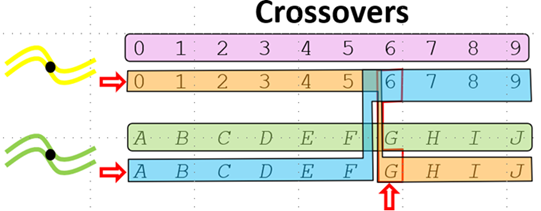

# Full Parasite Genetics (FPG) model


FPG extends the standard MALARIA_SIM model to track individual *P. falciparum* parasite genomes
through the complete lifecycle — from the founding infections that seed a simulation, through
replication within human hosts, across the mosquito transmission stages, and back into humans via
infectious bites.

FPG tracks four core processes:

- **Within-host strain tracking**: Each infection carries an explicit genome. A single infectious
  bite can deliver sporozoites carrying different genomes; each sporozoite that survives the bite
  and reaches the liver initiates a new infection — progressing independently through hepatocyte,
  asexual blood-stage, and gametocyte stages. A person can therefore acquire multiple simultaneous
  infections from a single bite, each with a distinct genome advancing on its own timeline.

- **Gametocyte and sporozoite sampling**: When a mosquito takes a blood meal from an infected human,
  gametocytes are sampled from the person's active infections, giving the strains present in the human the
  opportunity to contribute to oocyst formation.  Similarly, when an infectious mosquito bites a human,
  sporozoites are sampled from the mosquito, giving the strains present in the mosquito the opportunity
  to establish new infections in the human host.

- **Meiotic recombination**: When a mosquito ingests gametocytes from genetically distinct strains,
  recombination occurs during oocyst development, producing progeny genomes that are new combinations
  of the parental alleles.

- **Allele roots**: Every allele in the simulation carries a record of the ancestral infection from
  which it descended. This enables distinction between identity-by-descent (IBD) — alleles inherited
  from a common ancestor — and identity-by-state (IBS) — alleles that are identical but of
  independent origin.


## Genome representation


FPG models the *P. falciparum* genome as 14 chromosomes spanning 22,790,000 base pairs in total,
following the reference assembly of Gardner et al. (2002) [#gardnerref]_. Because genome length
estimates vary across sources, positions in the model should be understood as coordinates in this
specific reference assembly rather than as universal genomic positions. FPG represents each parasite
genome as two parallel arrays, each with one entry per tracked SNP
position:

- **Nucleotide sequence**: An integer array of allele values, where each value (0–3) corresponds to
  one of the four nucleotide bases (A=0, C=1, G=2, T=3) at a tracked genome position.

- **Allele roots**: A parallel integer array recording, for each position, the ID of the
  user-seeded infection — created via `OutbreakIndividualMalariaGenetics` — from which this allele
  originally descended. As alleles propagate through transmission and recombination, each carries
  its origin ID forward unchanged, enabling downstream analysis to distinguish identity-by-descent
  (IBD, alleles tracing to a common user-seeded infection) from identity-by-state (IBS, alleles
  with the same value but independent origins).

Users specify which genome positions to track by supplying lists of base-pair coordinates in the
configuration file (see the [configuration](#configuration) section). Positions can be designated as barcode
loci, drug resistance loci, or HRP loci. The total number of tracked positions directly affects
simulation memory usage and runtime — simulations tracking more positions will require more memory
and take longer to run.

For example, consider a simulation with 7 barcode positions, 2 drug resistance positions, and 1 HRP
position — 10 tracked positions in total, spanning chromosomes 1, 2, and 3. Each genome is
represented by two arrays of length 10. The example below shows a recombinant progeny genome derived
from two ancestral infections: infection ID 5 (whose allele roots are all 5 at every position) and
infection ID 6 (whose allele roots are all 6 at every position). The root switch within chromosome 1
— from 5 to 6 between positions 300 and 500 — is unambiguous evidence of a crossover in that
interval. The chromosome 2 positions all carry root 5 and the chromosome 3 positions all carry root
6, reflecting the ancestral origin at each tracked position; however, uniform roots within a
chromosome cannot distinguish independent assortment from a crossover that occurred outside the
tracked region.

```none
Barcode_Genome_Locations        = [100, 300, 500, 700000, 900000, 1700000, 2000000]
Drug_Resistant_Genome_Locations = [200, 800000]
HRP_Genome_Locations            = [600]

Genome = {
    "Nucleotide_Sequence": [0, 1, 2, 3, 0, 2, 3, 0, 1, 2],
    "Allele_Roots":        [5, 5, 5, 6, 6, 5, 5, 5, 6, 6]
}

locations  = [    100,        200,    300,    500, 600, 700000,     800000, 900000, 1700000, 2000000]
chromosome = [   chr1,       chr1,   chr1,   chr1,chr1,   chr2,       chr2,   chr2,    chr3,    chr3]
type       = [barcode, resistance, barcode, barcode, HRP, barcode, resistance, barcode, barcode, barcode]
sequence   = [      0,          1,       2,       3,   0,       2,          3,       0,       1,       2]
character  = [      A,          C,       G,       T,   A,       G,          T,       A,       C,       G]
roots      = [      5,          5,       5,       6,   6,       5,          5,       5,       6,       6]
#                                        ^crossover^   ^chr2: all root 5^           ^chr3: all root 6^
```

## Within-host model


FPG builds on the existing EMOD malaria within-host model, which is described in
[malaria-model-infection-immunity](malaria-model-infection-immunity.md). Each infection progresses through hepatocyte, asexual, and
gametocyte stages on its own timeline. Because each sporozoite that successfully reaches the liver
initiates a separate infection, a multiply-infected person carries multiple parasite populations
advancing independently — a behavior inherited from the base EMOD model, not specific to FPG.

For example, on day 1, a person gets an infectious bite from a mosquito that has half the sporozoites
with barcode AATT and half with TTAA.  This will create two infections.  If the person gets another
infectious bite on day 20 from a mosquito that only has sporozoites with AATT, the person will get
a third infection with AATT. This new infection begins its own independent progression on day 20 —
even though a day-1 AATT infection may still be active — because each infection
is tracked separately regardless of genome identity.

FPG adds the ability to configure how PfEMP1 major epitope antigens are assigned to each infection
via `Var_Gene_Randomness_Type`. In the standard malaria model, PfEMP1 variants are assigned
randomly. FPG adds the option to have PfEMP1 variants determined by the parasite genome through
recombination, so that infections sharing alleles at PfEMP1 loci are more likely to express similar
antigens. However, the degree of association between barcode IBD and antigen similarity depends on
the physical proximity of `PfEMP1_Variants_Genome_Locations` to the barcode loci — if PfEMP1
locations are placed far from barcode loci, recombination may decouple them. In all modes, minor
epitopes remain randomly assigned. Note that the genome-determined PfEMP1 feature (`FIXED_NEIGHBORHOOD`) requires validation before
being applied to simulations used for policy decisions.

!!! note
    The `Max_Individual_Infections` parameter in config.json caps the number of concurrent
    infections a person can carry. When a person is already at the cap and receives a new
    infectious bite, the sporozoites that would establish new infections are discarded. The 2018
    EMOD calibration set this to 3, which was appropriate for epidemiological modeling and
    reflected a real performance constraint at the time — larger infection counts made EMOD
    substantially slower. Subsequent performance improvements have largely eliminated that
    constraint. For FPG simulations, a value of 3 artificially suppresses genetic diversity: it
    limits the number of distinct genomes that can co-circulate within a host and be transmitted
    together to a mosquito, reducing the opportunities for recombination and underrepresenting
    the true complexity of infection seen in high-transmission settings. FPG simulations should
    use a value closer to 20.

## Transmission


FPG replaces EMOD's contagion-pool transmission model (in which infectiousness is aggregated across
all infected individuals and applied probabilistically across the population) with one-to-one
transmission that links specific source humans to specific mosquitoes and specific recipient humans,
preserving genome identity at each step.

### Human-to-vector


When an infectious mosquito takes a blood meal from an infected human, gametocytes are sampled from
the person's active infections proportionally to each infection's gametocyte density, using a
multinomial draw. The number of gametocytes in the blood meal is proportional to the person's total
gametocyte density, scaled by the fraction of blood taken during feeding, with a minimum of two (one
male, one female) required to form an oocyst. The exact count is not the critical quantity — what
matters is that the relative density across infections determines each strain's probability of
contributing gametocytes to the blood meal. The number of oocysts formed is then drawn independently
from a negative binomial distribution — the oocyst count is not determined by the number of
gametocytes sampled. Male and female gametocytes are then paired for each oocyst using a
multivariate hypergeometric draw without replacement; if either sex is absent from the blood meal,
no oocysts form.

Once formed, oocysts develop over a temperature-dependent period governed by an Arrhenius
relationship — the same process that determines the extrinsic incubation period (EIP) in the base
EMOD model; see [vector-model-transmission](vector-model-transmission.md) for the governing parameters. Each oocyst produces
a cohort of sporozoites sharing the same recombinant genome (see the [meiotic-recombination](#meiotic-recombination)
section). Sporozoites accumulate in the mosquito's salivary glands and decay over time at a
configurable rate. If all sporozoites die before the mosquito acquires new infections, the mosquito
reverts to an uninfected state — unlike the base EMOD model, where a vector remains infectious
once it reaches that state.

If an infected or infectious mosquito bites another infected human, she can acquire new gametocytes,
form new oocysts, and produce additional sporozoite cohorts alongside any already present. As with
infections in the human host, gametocytes ingested from different bites develop on independent
timelines. The resulting sporozoite cohorts may carry genomes derived from different human hosts,
introducing additional genetic diversity into the mosquito's sporozoite pool.

### Vector-to-human


A person may receive infectious bites from multiple mosquitoes within a single time step;
sporozoites from all bites are accumulated and processed together.

When an infectious mosquito bites a susceptible human, the number of sporozoites transmitted is
drawn from a negative binomial distribution. Sporozoites are allocated across the mosquito's
salivary gland cohorts proportionally to each cohort's density using a multinomial draw, so genomes
that are more abundant are more likely to be transmitted.

For each genome cohort delivered, a Poisson draw determines how many sporozoites successfully infect
hepatocytes — with mean equal to the cohort size multiplied by `Base_Sporozoite_Survival_Fraction`
(see [parameter-configuration-parasite](parameter-configuration-parasite.md)). If at least one succeeds, a new infection is
established with that count as its initial hepatocyte load, progressing independently through the
incubation period before transitioning to the asexual blood stage.

All numerical parameters in the transmission model — including sporozoites per bite and hepatocyte
survival fraction — are derived from empirical literature and are configurable; see the
[configuration](#configuration) section for details.


## Meiotic recombination


Meiotic recombination occurs during oocyst development when a mosquito has ingested gametocytes of
genetically distinct strains. FPG implements the obligate chiasma framework of Wong et al. (2018),
calibrated against laboratory crosses of *P. falciparum*.

When the male and female parental genomes of an oocyst are identical, recombination is skipped and
the four progeny genomes are clones of the parent. When the parents are genetically distinct, meiosis
proceeds as follows.

**Crossover placement**: On each of the 14 chromosomes, one obligate crossover is placed at a
uniformly random position along the chromosome. Each crossover always occurs between one maternal
and one paternal chromatid — never between two chromatids of the same parent. The specific chromatid
pair involved in each crossover is selected randomly. Additional secondary crossovers are placed
bidirectionally outward from the obligate position, with inter-crossover distances drawn from a gamma
distribution (shape k=2, scale θ=0.38 cM, mean 0.76 cM). Centimorgan distances are converted to base
pairs at a rate of approximately 1,500 kilobases per cM, yielding a mean inter-crossover distance of
roughly 1.14 Mb. Because chromosomes vary in length (0.6–3.3 Mb), shorter chromosomes typically
receive only the obligate crossover while longer ones receive one to three secondary crossovers.

**Progeny assembly**: All crossover positions are fixed in the original genomic coordinate space
before any exchanges occur. Each crossover exchanges the tail of the two participating chromatids at
their current state; subsequent crossover positions are not recalculated based on prior exchanges.
At each crossover point, allele values and allele roots are exchanged between the participating
chromatids. Each of the four progeny genomes then receives exactly one chromatid
from each of the 14 chromosome tetrads, with the chromatid-to-progeny assignment randomized
independently per chromosome (independent assortment). Sporozoites are distributed equally among the
four progeny genotypes, so each sibling genotype represents approximately one-quarter of the
oocyst's sporozoites. A single outcrossed oocyst therefore contributes four distinct recombinant
genotypes to the vector's sporozoite pool.

The figure below illustrates a single crossover between two parental chromatids. Parent 1 (top)
carries alleles 0–9 at positions 0–9; Parent 2 (bottom) carries alleles A–J at the same positions.
A crossover occurs between positions 5 and 6 (indicated by the arrow). The exchange produces two
recombinant chromatids: one carrying Parent 1's alleles (0–5) to the left of the crossover and
Parent 2's alleles (G–J) to the right, and the complementary recombinant carrying Parent 2's
alleles (A–F) on the left and Parent 1's alleles (6–9) on the right. The highlighted segments show
the portions exchanged between the two chromatids at the crossover point.




## Seeding infections


`OutbreakIndividualMalariaGenetics` is the FPG counterpart to EMOD's standard
`OutbreakIndividual` intervention. Rather than arising through transmission, it directly introduces
infections with user-specified parasite genomes into targeted individuals. All human infections in
EMOD have a unique infection ID. What makes an infection created by
`OutbreakIndividualMalariaGenetics` an **ancestral infection** is that the allele root at every
genome position is set to that infection's own ID — rather than being inherited from a parent genome.
This establishes the infection as the root of a lineage, enabling identity-by-descent (IBD) tracking
of all descendant alleles as they propagate through the simulation.

The genome for each seeded infection is specified via `Create_Nucleotide_Sequence_From`, which
selects one of three modes:

- **BARCODE_STRING** (default): Specify the genome using `Barcode_String`, with optional
  `Drug_Resistant_String` and `HRP_String`. Every infection seeded by this outbreak instance
  receives the same genome. To introduce multiple distinct genotypes, use multiple
  `OutbreakIndividualMalariaGenetics` events with different strings.

- **NUCLEOTIDE_SEQUENCE**: Specify the complete genome, including the barcode (`Barcode_String`),
  drug resistance loci (`Drug_Resistant_String`), HRP loci (`HRP_String`), MSP variant
  (`MSP_Variant_Value`), and PfEMP1 major epitope values (`PfEMP1_Variants_Values`).

- **ALLELE_FREQUENCIES**: Each infection's genome is drawn independently from per-position allele
  frequencies (`Barcode_Allele_Frequencies_Per_Genome_Location`,
  `Drug_Resistant_Allele_Frequencies_Per_Genome_Location`,
  `HRP_Allele_Frequencies_Per_Genome_Location`). This mode is useful for seeding a genetically
  diverse founding population without specifying every individual genome. However, the actual
  diversity in the initial population is limited by the number of ancestral infections introduced —
  seeding only a small number of infections will produce limited genetic variation regardless of the
  allele frequencies specified. Users should consider how the combination of allele frequencies and
  number of seeded infections will shape the genetic diversity of the founding population.

`OutbreakIndividualMalariaGenetics` can only be used when `Malaria_Model` is set to
`MALARIA_MECHANISTIC_MODEL_WITH_PARASITE_GENETICS`; using the standard `OutbreakIndividual` in
that mode will raise a configuration error.


## Drug resistance


FPG models drug resistance by modifying drug killing effects based on the parasite's genome. When
EMOD computes the drug kill rate for an infection, it passes the parasite's genome to the drug
model, which checks whether specific alleles are present at designated positions. If the genome
matches, one or more modifiers are applied to the drug's efficacy parameters. This allows users to
model parasites that are more or less susceptible to a given drug based on their genetic makeup.

Drug killing is modeled across five parasite life stages: hepatocytes, infected red blood cells
(IRBCs), gametocyte stages 0–2, gametocyte stages 3–4, and mature gametocytes. For each stage, the
drug has a parameter that converts concentration-derived efficacy into a killing rate. Resistance
modifiers scale these parameters for parasites carrying specific alleles.

### Configuring resistance in the drugs


Genome positions used for drug resistance tracking are specified in
`Parasite_Genetics.Drug_Resistant_Genome_Locations` in config.json (see the
[configuration](#configuration) section). Resistance behavior for each drug is then configured in
`Malaria_Drug_Params` by adding a `Resistances` array to the drug entry. Each element of the
array is a resistance object with the following parameters:

```
Drug_Resistant_String, string, —, "A string of nucleotide characters (``A``, ``C``, ``G``, ``T``, or ``*`` for wildcard) — one per position in ``Drug_Resistant_Genome_Locations``. The modifier is applied only if the parasite's genome matches all non-wildcard positions in this string."
PKPD_C50_Modifier, float, 1.0, "Multiplied times ``Drug_PKPD_C50`` when the string matches. Values above 1.0 reduce drug potency; values below 1.0 increase it."
Max_IRBC_Kill_Modifier, float, 1.0, "Multiplied times ``Max_Drug_IRBC_Kill`` when the string matches."
```

If a parasite's genome matches multiple resistance objects, the modifiers from each matching object
are multiplied together. The following example configures Artemether with two resistance objects,
assuming `Drug_Resistant_Genome_Locations` has two positions. A `T` at the first position
reduces IRBC killing to 5% of baseline; an `A` at the second position independently increases
potency by reducing `Drug_PKPD_C50` and reduces IRBC killing via `Max_Drug_IRBC_Kill`.
The `*` wildcard means that position is ignored for matching:

[link](../json/malaria-model-fpg.json)

!!! note
    The drug efficacy model checks specific allele patterns defined in each drug's `Resistances`
    array. The InsetChart drug resistance channels use a simpler criterion: any infection with a
    non-`A` allele at any position in `Drug_Resistant_Genome_Locations` is counted as resistant,
    regardless of which drug or which specific allele pattern triggered resistance.

### Seeding resistance


Drug resistant strains are introduced into the simulation using
`OutbreakIndividualMalariaGenetics` with `Drug_Resistant_String` (for `BARCODE_STRING` and
`NUCLEOTIDE_SEQUENCE` modes) or `Drug_Resistant_Allele_Frequencies_Per_Genome_Location` (for
`ALLELE_FREQUENCIES` mode). See the [seeding-infections](#seeding-infections) section for details. Once
introduced, resistance alleles propagate and recombine through the simulation like any other
genome position.


## HRP2/3 deletion


*Plasmodium falciparum* secretes histidine-rich proteins HRP2 and HRP3 into the bloodstream. Most
rapid diagnostic tests (RDTs) target HRP2 as a marker of active infection. Parasites carrying
deletions of the *pfhrp2* and/or *pfhrp3* genes produce no HRP2 protein and test false-negative on
HRP2-based RDTs despite active infection.

FPG tracks HRP gene status as allele values at positions designated by `HRP_Genome_Locations` in
`Parasite_Genetics`. Each position represents one HRP locus:

- An allele of `A` indicates the HRP gene at that position is **present** (functional) — the
  infection produces HRP2 protein.
- Any other allele (`C`, `G`, or `T`) indicates the HRP gene is **deleted** at that position.

An infection is classified as "HRP-deleted" only when **all** designated HRP positions carry a
non-`A` allele. If any position retains `A`, the infection is treated as HRP-expressing. This
allows independent representation of *pfhrp2* and *pfhrp3*: defining two HRP positions (one per
gene) means an infection with *pfhrp2* deleted but *pfhrp3* intact still produces HRP2 protein,
reflecting the cross-reactivity of pfhrp3 with HRP2-targeting RDTs.

### HRP2 protein dynamics


Each time step, the host's circulating HRP2 level is updated from the IRBCs of HRP-expressing
infections only. HRP-deleted infections contribute zero IRBCs to this sum. The dynamics follow
Marquart et al. (2012) [#hrp2ref]_:

$$\frac{d[\text{HRP2}]}{dt} = B \cdot \text{IRBC}_{HRP} - D \cdot [\text{HRP2}]$$

where $[\text{HRP2}]$ is the circulating HRP2 protein level (pg), $\text{IRBC}_{HRP}$
is the total number of infected red blood cells from HRP-expressing infections, $B$ is
`PfHRP2_Boost_Rate` (pg per iRBC per day), and $D$ is `PfHRP2_Decay_Rate` (per day). The
decay term is approximated as linear within each time step. These parameters are configurable; see
the [configuration](#configuration) section.

Interventions and diagnostics using the `PF_HRP2` measurement type compare the accumulated HRP2
level against the `Report_Detection_Threshold_PfHRP2` threshold.

### Seeding HRP deletions


HRP status is set when ancestral infections are seeded via `OutbreakIndividualMalariaGenetics`.
In `BARCODE_STRING` or `NUCLEOTIDE_SEQUENCE` mode, the `HRP_String` parameter assigns a fixed
HRP genotype to every seeded infection — one character per position in `HRP_Genome_Locations`.
For example, with two HRP positions representing *pfhrp2* and *pfhrp3*:

- `"AA"` — both genes intact; infection is fully HRP-expressing.
- `"CA"` — *pfhrp2* deleted, *pfhrp3* intact; infection still produces HRP2 protein.
- `"CT"` — both genes deleted; infection is fully HRP-deleted.

In `ALLELE_FREQUENCIES` mode, use `HRP_Allele_Frequencies_Per_Genome_Location` to seed a
mixture of HRP genotypes across the population. See the [seeding-infections](#seeding-infections) section for
details.


## Configuration


FPG is enabled by setting `Malaria_Model` to
`MALARIA_MECHANISTIC_MODEL_WITH_PARASITE_GENETICS` in config.json. All FPG-specific parameters
are nested under the `Parasite_Genetics` key in config.json.

### Genome position parameters


The most fundamental configuration choices are which genomic positions to track. Positions are
integer base-pair coordinates in the linearized *P. falciparum* genome — chromosomes 1 through 14
concatenated end to end into a single coordinate space of 22,790,000 bp. The table below lists the
length and position range of each chromosome.

```
1,"643,000","1 – 643,000"
2,"947,000","643,001 – 1,590,000"
3,"1,100,000","1,590,001 – 2,690,000"
4,"1,200,000","2,690,001 – 3,890,000"
5,"1,300,000","3,890,001 – 5,190,000"
6,"1,400,000","5,190,001 – 6,590,000"
7,"1,400,000","6,590,001 – 7,990,000"
8,"1,300,000","7,990,001 – 9,290,000"
9,"1,500,000","9,290,001 – 10,790,000"
10,"1,700,000","10,790,001 – 12,490,000"
11,"2,000,000","12,490,001 – 14,490,000"
12,"2,300,000","14,490,001 – 16,790,000"
13,"2,700,000","16,790,001 – 19,490,000"
14,"3,300,000","19,490,001 – 22,790,000"
```

Positions are assigned to one of the following functional categories. No two parameters may share a
position, and positions within a single parameter must be in ascending order.

```
Barcode_Genome_Locations, list of integers, "Genome positions of barcode SNP loci. The number of positions determines the required length of ``Barcode_String`` in ``OutbreakIndividualMalariaGenetics`` and in report filters. Can be empty if no barcode positions are tracked."
Drug_Resistant_Genome_Locations, list of integers, "Genome positions of drug resistance loci. These locations and their allele values can be referenced in ``Malaria_Drug_Params.Resistances`` to modify drug efficacy based on parasite genotype."
HRP_Genome_Locations, list of integers, "Genome positions of HRP (histidine-rich protein) loci. An allele value of ``A`` at a position indicates the HRP gene is present (functional); any other value (``C``, ``G``, ``T``) indicates the gene is deleted at that position. An infection is HRP-deleted only when all positions carry a non-``A`` allele. See the HRP2/3 Deletion section for details."
MSP_Genome_Location, integer, "Genome position of the MSP locus. Only used when ``Var_Gene_Randomness_Type`` is ``FIXED_NEIGHBORHOOD`` or ``FIXED_MSP``."
PfEMP1_Variants_Genome_Locations, list of integers, "Genome positions of PfEMP1 major epitope loci. Must define exactly 50 locations corresponding to the 50 PfEMP1 variants in each clonal infection's repertoire (see [Malaria infection and immune model](malaria-model-infection-immunity.md)). Only used when ``Var_Gene_Randomness_Type`` is ``FIXED_NEIGHBORHOOD``."
```

The total number of tracked positions — barcode + drug resistance + HRP (+ MSP and PfEMP1 if
applicable) — directly affects simulation memory usage and runtime. More tracked positions require
more memory and increase simulation time.

### Antigen expression


```
Var_Gene_Randomness_Type, enum, ALL_RANDOM, "Controls how MSP and PfEMP1 major epitope antigens are assigned to each new infection. ``ALL_RANDOM``: MSP and PfEMP1 major epitope antigens are both randomly assigned for every infection, matching base model behavior. ``FIXED_MSP``: MSP is genome-determined; PfEMP1 major epitopes remain random. ``FIXED_NEIGHBORHOOD``: both MSP and PfEMP1 major epitopes are genome-determined. In all modes minor epitopes (the five nonspecific epitopes associated with each PfEMP1 variant; see [Malaria infection and immune model](malaria-model-infection-immunity.md)) are always randomly assigned."
Neighborhood_Size_MSP, integer, 4, "When ``Var_Gene_Randomness_Type`` is ``FIXED_NEIGHBORHOOD`` or ``FIXED_MSP``, the number of adjacent MSP variants from which the strain's MSP value is drawn. Must not exceed ``Falciparum_MSP_Variants``."
Neighborhood_Size_PfEMP1, integer, 10, "When ``Var_Gene_Randomness_Type`` is ``FIXED_NEIGHBORHOOD``, the number of adjacent PfEMP1 variants from which each epitope value is drawn. Must not exceed ``Falciparum_PfEMP1_Variants``."
```

### Transmission parameters


```
Sporozoites_Per_Oocyst_Distribution, enum, CONSTANT_DISTRIBUTION, "Distribution type for the number of sporozoites produced per oocyst. Follows standard EMOD distribution configuration."
Sporozoite_Life_Expectancy, float, 10.0, "The number of days a sporozoite survives in the mosquito. The mortality rate is the inverse of this parameter."
Num_Sporozoites_In_Bite_Fail, float, 12.0, "Negative binomial parameter (number of failures) for sporozoites transmitted per infectious bite."
Probability_Sporozoite_In_Bite_Fails, float, 0.5, "Negative binomial parameter (probability of failure) for sporozoites transmitted per infectious bite."
Num_Oocyst_From_Bite_Fail, float, 3.0, "Negative binomial parameter (number of failures) for oocysts formed per human-to-vector bite."
Probability_Oocyst_From_Bite_Fails, float, 0.5, "Negative binomial parameter (probability of failure) for oocysts formed per human-to-vector bite."
```

### Recombination parameters


```
Crossover_Gamma_K, float, 2.0, "Shape parameter (k) of the gamma distribution for secondary inter-crossover distances during meiosis. The mean inter-crossover distance is k×θ cM and the variance is k×θ² cM². Output is in centimorgans converted internally to base pairs."
Crossover_Gamma_Theta, float, 0.38, "Scale parameter (θ) of the gamma distribution for secondary inter-crossover distances during meiosis. The mean inter-crossover distance is k×θ cM and the variance is k×θ² cM²."
```

### HRP protein dynamics


```
PfHRP2_Boost_Rate, float, 0.07, "Rate at which HRP2 protein accumulates from HRP-expressing IRBCs (pg per iRBC per day)."
PfHRP2_Decay_Rate, float, 0.172, "Daily fractional decay of circulating HRP2 protein (corresponding to a half-life of approximately 3.67 days)."
```

### Similarity to base model


```
Enable_FPG_Similarity_To_Base, boolean, false, "If true, FPG simulates the base MALARIA_SIM model: a person can acquire only one new infection per time step, and a vector is always considered infected once it acquires an infection. Provided for validation — allows direct comparison of FPG and base model output."
```

## Output reports


FPG provides two dedicated output reports and enhances several existing reports with genetic data.

### FPG-specific reports


[software-report-fpg-output-observational-model](software-report-fpg-output-observational-model.md) (`ReportFpgOutputForObservationalModel`) is
the primary report for FPG workflows. It samples the infected human population and generates three
output files: a CSV of infected individuals with their genome indices, and two numpy binary files
containing the nucleotide sequences and allele roots for each referenced genome. This report is
designed for use in full parasite genetics post-processing pipelines.

[software-report-fpg-new-infections](software-report-fpg-new-infections.md) (`ReportFpgNewInfections`) provides detailed data on
each new human infection as it occurs, including the genome of the infecting parasite. When
`Report_Crossover_Data_Instead` is set to true, it instead records the crossover locations that
produced each infection's genome, which is useful for validating recombination behavior.

### Reports with FPG-enhanced output


[software-report-sql-malaria-genetics](software-report-sql-malaria-genetics.md) (`SqlReportMalariaGenetics`) records barcode and full
nucleotide sequence data in two additional database tables — `ParasiteGenomes` and
`GenomeSequenceData` — alongside the standard epidemiological tables. A `DrugStatus` table
tracking drug name, current efficacy, and remaining doses for each person at each time step can be
enabled via `Include_Drug_Status_Table`.

[software-report-malaria-node-demographics-genetics](software-report-malaria-node-demographics-genetics.md)
(`ReportNodeDemographicsMalariaGenetics`) extends the standard malaria node demographics report by
adding per-barcode infection counts, stratified by node and time step. The `Drug_Resistant_Strings`
parameter adds columns counting infections with specific drug resistance allele patterns, including
wildcard (`*`) matching.

[software-report-vector-stats-malaria-genetics](software-report-vector-stats-malaria-genetics.md) (`ReportVectorStatsMalariaGenetics`) extends
the standard vector statistics report with genetic barcode data on the parasites carried in the
vector population, including details on oocysts and sporozoites.

### InsetChart channels


When FPG is enabled, InsetChart.json includes the following additional channels beyond the standard
malaria channels:

```
Avg Num Vector Infs, "The average number of distinct oocyst and sporozoite cohorts currently present in infected vectors."
Complexity of Infection, "The mean number of distinct parasite genomes per infected person (complexity of infection, COI). Distinct genomes are identified by barcode hashcode only — drug resistance, HRP, MSP, and PfEMP1 loci are not considered."
Drug Resistant Fraction of All Infections, "The fraction of all active human infections that have a non-``A`` allele at any position in ``Drug_Resistant_Genome_Locations``."
Drug Resistant Fraction of Infected People, "The fraction of currently infected people who have at least one infection with a non-``A`` allele at any position in ``Drug_Resistant_Genome_Locations``."
HRP Deleted Fraction of All Infections, "The fraction of all active human infections that are HRP-deleted (all HRP loci carry a non-``A`` allele)."
HRP Deleted Fraction of Infected People, "The fraction of currently infected people who have at least one HRP-deleted infection."
Infected and Infectious Vectors, "The fraction of adult vectors that are infected (have acquired gametocytes but not yet produced sporozoites) or infectious (have sporozoites in salivary glands)."
New Vector Infections, "The number of vectors that acquired new infections from human blood meals during this time step."
Num Total Infections, "The total count of active human infections across all individuals in the simulation."
PfHRP2 Prevalence, "The fraction of the population that would test positive on an HRP2-based rapid diagnostic test, based on whether circulating HRP2 exceeds ``Report_Detection_Threshold_PfHRP2``."
```

## FPG Observational Model


The [FPGObservationalModel][fpg-observational-model] is a separate
Python tool that converts the output of
[software-report-fpg-output-observational-model](software-report-fpg-output-observational-model.md) into realistic genomic surveillance data.
Rather than analyzing the full simulated population directly, it applies configurable sampling
strategies that mirror how field surveillance data would actually be collected, then computes genetic
metrics on the resulting sample.

The tool follows a three-step workflow:

1. **Hard filtering** — restrict the infection pool by criteria such as symptomatic-only infections
   or monogenomic infections.
2. **Sampling** — draw a sample from the filtered pool using random, seasonal, or age-directed
   sampling strategies.
3. **Metric computation** — calculate genetic statistics on the sample.

Genetic metrics computed include complexity of infection (true and effective COI), co-transmission
proportions, heterozygosity, identity-by-descent and identity-by-state (IBD/IBS) pairwise
statistics, the relatedness coefficient (Rh) for polygenomic infections, within-host diversity
(Fws), allele frequencies, and proportions of monogenomic and unique genomes.

The tool produces three output files: a sampled infections CSV with individual-level metrics, a
model summaries CSV with population-level statistics aggregated by time period and subpopulation,
and an IBx distributions JSON file with pairwise relatedness distributions.

An end-to-end example of running FPG with EMOD and invoking the FPGObservationalModel via
post-processing is provided in the emodpy-malaria repository at `examples-container/fpg_example`,
where it is called from the `dtk_post_process.py` script after the simulation completes.


