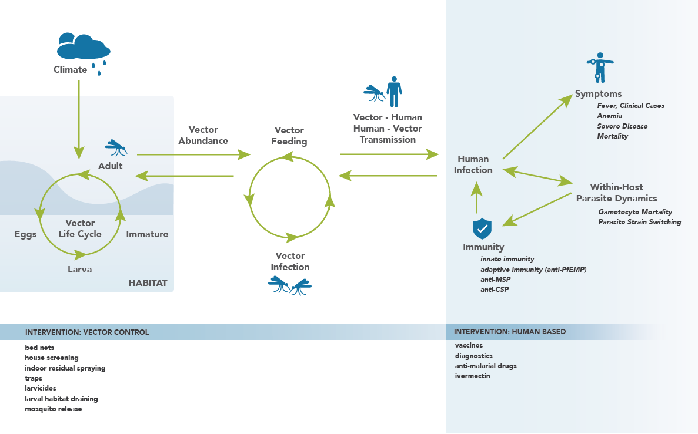

# Malaria transmission and treatment

The malaria model inherits the functionality of the vector model and introduces human immunity,
within-host parasite dynamics, effects of antimalarial drugs, and other aspects of malaria biology
to simulate malaria transmission. For example, individuals can have multiple infections and both
innate and adaptive responses to antigens. To use the malaria model, set the configuration
parameter **Simulation_Type** to MALARIA_SIM.

## Discrete and continuous processes

The model implements a hybrid of discrete and continuous processes that work together to capture
system latencies and discrete events inherent in the population dynamics of humans and mosquitoes, and
parasites. Discrete events, such as latencies in the infected *hepatocyte* stage, the length
of the asexual cycle from *merozoite* invasion to *schizont* rupture, and
*gametocyte* maturation have particular time durations. State changes occur after the
completion of the required amount of time (with specific time durations set for each state).
See the figure of the *Plasmodium* life-cycle in [malaria-overview](malaria-overview.md) for more information
regarding the life-cycle stages used in this example.

Other processes, such as the decay of antibodies and the clearance of parasites, are represented by
continuous-time processes. These are solved with a one-hour time step *Euler method*. All parasite
quantities, such as the number of hepatocytes, number of merozoites, number of infected red blood
cells of each antigenic variant, and gametocytes of each stage are represented as discrete integers.
The infection is not cleared until each category is reduced to zero. This allows resolution of model
dynamics at *subpatent* levels.

If using the modified mosquito cohort model introduced with the vector model, it allows
temperature-dependent progression through *sporogony*, even with a different mean temperature
each day, with no mosquitoes passing from susceptible to infectious before the full discrete
latency.

## Model components

The malaria model is complex, with numerous configurable parameters. The following network
diagram breaks down the model into various model components, and illustrates how they interact with
one another.  The components on the network diagram correspond to the structural components  listed
below. Note that there is  not perfect overlap between the labels on the network diagram and the
structural components; this is because the network is drawn with increased detail in order to
provide clarity in how the model functions and the components interact. The following pages will
describe in detail how the structural components function.

*Network diagram illustrating the malaria model and its constituent components.*

As new technology arises and novel types of interventions become available, it will be
relatively seamless to integrate them into the current model structure. For example, as genetic
technology improves and testing the utility of utilizing GM mosquitoes (such as a gene drive mosquito) in control efforts becomes important, EMOD will have no difficulty
integrating this novel intervention into simulations.

The following pages describe the structure of the model and explore each of the model components.
Additionally, the specifics of the model are discussed in detail in the articles
[Eckhoff, Malaria Journal 2011, 10:303][eckhoff-2011];
[Eckhoff, Malaria Journal 2012, 11:419][eckhoff-2012-mj];
[Eckhoff, PLoS ONE 2012, 7(9)][eckhoff-2012-plos];  and
[Eckhoff, Am. J. Trop. Med. Hyg. 2013, 88(5)][eckhoff-2013].
