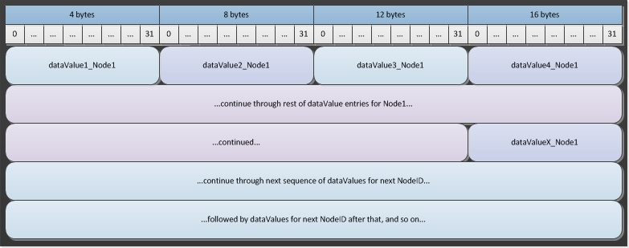
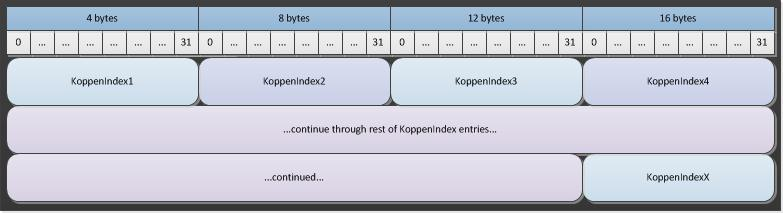

# Climate files


There are two general types of climate files usable by EMOD, namely, climate files generated
through actual data, referred to as "climate by data," and climate files generated from the Koppen
classification system, referred to as "climate by Koppen." Climate data (both types) is contained in
a set of two files, a metadata file with header information (<name>.bin.json) and a binary data file
(<name>.bin).

The metadata file is a JSON-formatted file that includes a metadata section and a node offsets
section. The **Metadata** parameter contains a JSON object with parameters, some of which are
strictly  informational and some of which are used by EMOD. However, the informational ones may
still be important to understand the provenance and meaning of the data.

In a second section, the **NodeOffsets** parameter contains a list of hex-encoded 16-byte values
used to find the data for each given node (the **NodeID**).They are not 16-byte offsets, but
instead, two 8-byte hex-encoded character strings. This encoding includes the source **NodeID**. You
can map the binary data to its corresponding source **NodeID** by using the **NodeOffset**
information.


The binary file contains the climate data in a sequential stream. In other words, it presents
all the data for the first node, then all the data for the second node, all the way through to the
last node.

To use the climate files, you must set **Climate_Model** to either "CLIMATE_BY_DATA" or
"CLIMATE_BY_KOPPEN", as appropriate, in the configuration file. There are also additional parameters
in the configuration file you can use to scale or otherwise modify the data included in the
climate files.

## Climate by data


Climate by data files contain real data gathered from weather stations in the region to be
simulated. This includes rainfall, temperature, relative humidity, and so on. At this time, the
EMOD reads land temperature data, but does not use the data in any calculations. IDM clones
the air temperature and uses that as the land temperature in the climate data files. If you are
going to be constructing your own climate files, we advise you to do the same.


### Metadata file


The following parameters in the metadata section are informational:

```
DateCreated, string, The day the file was created.
Author, string, The author of the file.
OriginalDataYears, string, The years from which the original data was derived.
StartDayOfYear, string, The day of the year representing the first day in the climate file.
DataProvenance, string, The source of the data.
```

The following parameters in the metadata section are used by EMOD:

```
IdReference, string, "A unique, user-selected string that indicates the method used for generating **NodeID** values in the input file. For more information, see [Input files](software-inputs.md)."
NodeCount, integer, The number of nodes to expect in this file.
DatavalueCount, integer, The number of data values per node. The number must be the same across every node in the binary file.
UpdateResolution, enum, "The time resolution of the climate file. Available values are:

* CLIMATE_UPDATE_YEAR
* CLIMATE_UPDATE_MONTH
* CLIMATE_UPDATE_WEEK
* CLIMATE_UPDATE_DAY
* CLIMATE_UPDATE_HOUR"
```

An example of climate by data metadata is as follows:

[link](../json/software-climate-1.json)

### Binary file


The binary file is a stream of 4-byte floating point values that contain the data value at the data
count position for a given node, running from 1 to the maximum data count value.

The binary format is as follows:



## Climate by Koppen


The Koppen_ classification system is one of the most widely used climate classification systems. The
Koppen classification system makes the assumption that native vegetation is the best expression of
climate.


### Metadata file


The following parameters in the metadata section are informational:

```
DateCreated, string, The day the file was created.
Author, string, The author of the file.
DataProvenance, string, The source of the data.
Tool, string, The script used to create the file.
```

The following parameters in the metadata section are used by EMOD:

```
IdReference, string, "A unique, user-selected string that indicates the method used for generating **NodeID** values in the input file. For more information, see [Input files](software-inputs.md)."
NodeCount, integer, The number of nodes to expect in this file.
```

An example of climate by Koppen metadata is as follows:

[link](../json/software-climate-2.json)

### Binary file


The binary file parameters use the naming convention below to store the data.

```
KoppenIndexX, "integer, 4 bytes", "The Koppen Index value, with X running from 1 to the maximum number of nodes."
```

The binary format is as follows:



