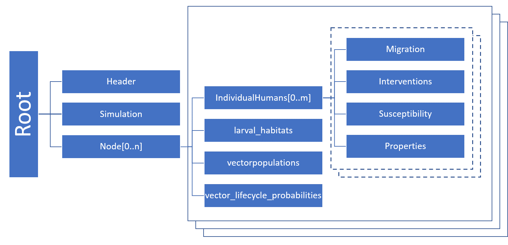

# Serialized population file

To model a population with endemic disease, you cannot use a common  modeling technique in which you
introduce a disease outbreak to a naive population and analyze the immediate aftermath. Doing so
would  create a population missing the levels of natural immunity built up in the population due to
the history of exposure to the pathogen. Instead, you must run the simulation for a period of time
until the disease dynamics reach an equilibrium (aside from  *stochastic* noise). This is
known as steady state. The simulation output prior to that point is disregarded.  This is a modeling
concept known as *simulation burn-in*, borrowed from the electronics industry where the first
items produced by a manufacturing process are discarded before the process is applied.

However, the time necessary to run simulations until this point can be significant, especially for
large populations. Indeed, for endemic disease present at low absolute prevalence, you should
simulate a larger population size that allows a small number of infected individuals to be
represented.

EMOD avoids the need to run the burn-in period again and again with each simulation by using
serialization to save the population state after it reaches equilibrium. Then, when you  want to
begin a subsequent simulation investigating the outcome of a particular set of interventions, you
can begin the simulation at that point rather than needing to re-run the burn-in period. You can
serialize the population at multiple time steps during a simulation.

The serialized population files created are placed in the output directory and use the naming
convention  state-<timestep>.dtk. They are binary files that contain state information about every
agent in a simulation: their health status, age, property values, and more. These files can be consumed
by subsequent simulations to decrease run time.

!!! note
    If you used repeating interventions during the burn-in period, those interventions will not continue
    based on the information in the serialized population file. Check your campaign file for repeating
    interventions and reconfigure them as needed for the period after burn-in.

    Not every type of intervention can be serialized. Please see [Individual interventions](parameter-campaign-individual-interventions.md)
    and [Node interventions](parameter-campaign-node-interventions.md) for information on which interventions can
    be serialized.

See [Setup configuration](parameter-configuration-setup.md) parameters for more information on configuration. See
[software-serializing-pops](software-serializing-pops.md) for more information on utilizing serialized populations in your
simulations.

## File format

A serialized population file is a sequence of independently compressed chunks written in a fixed
order. The file is not a single JSON tree — the simulation, nodes, and human agents are stored in
separate chunks so that each can be loaded and freed independently, keeping peak memory usage low.

The following figure gives an overview of the chunk layout.

The chunks appear in this order on disk:

1. **Simulation chunk** (one) — the simulation object with an empty node list.
2. **Node chunks** (one per node) — each node’s non-human data: larval habitats, vector
   populations, and vector lifecycle probabilities. Individual humans are **not** stored here.
3. **Human collection chunks** (one or more per node) — each chunk holds up to
   **Serialization_Max_Humans_Per_Collection** (default 2000) individuals and is tagged in the
   header with the SUID of the node they belong to. Each individual carries its own Migration,
   Interventions, Susceptibility, and Properties. A node with a large population produces multiple
   human collection chunks.

Each chunk is compressed independently using LZ4, SNAPPY, or no compression, chosen automatically
based on the size of the data. Different chunks in the same file may use different compression schemes.

### Internal state

The structure of a serialized population file reflects the internal state of the objects used in
the simulation. At the configured timestep, the simulation serializes the simulation object, then
each node (without its humans), then the human agents in collections. Each object calls the
serialize method of its members in turn — an individual, for instance, serializes its infections,
interventions, susceptibility, and properties. This continues until there are no more objects.

All objects that are instantiated from classes that inherit from ISerializable and implement the
ISerializable interface can write themselves to a buffer. A JSON writer adds variable names and
formatting so that a valid JSON chunk is generated. A similar mechanism is at play when a
simulation is loaded from a file — the names of variables and their values are used to
re-instantiate the same objects. Because EMOD is written in a compiled language, the description
of data and objects (classes and variable types) in the source code must match the data types in
the serialized population file exactly — for example, if a variable is of type integer, changing
its value to a float in the source will not have the anticipated effect.

### Multi-core

If the simulation is run on several cores, each core saves one file at the configured timestep(s).
To continue the simulation one EMOD file must be defined per node.

### File Name

The format for single core is: state-timestep.dtk e.g. state-00100.dtk

The format for multi-core is: state-timestep-core.dtk e.g. state-00100-001.dtk

### Header

Each file begins with a 4-byte magic number (`IDTK`), followed by a 12-character decimal field
giving the header size in bytes, followed by the header JSON. The header size is fixed based on the
number of nodes and human collections, which allows the header to be overwritten with final chunk
sizes after the chunks are written.

The current header format (version 6) contains the following fields:

| Parameter | Example | Type | Description |
| --- | --- | --- | --- |
| version | 6 | Integer | File format version number |
| author | IDM | String | Author of the file |
| tool | DTK | String | Tool used to create the file |
| date | Mon Jan 01 00:00:00 2025 | String | Date and time the file was created |
| emod_info | {} | Object | EMOD version information |
| sim_compression | LZ4 | NON, LZ4, SNA | Compression used for the simulation chunk |
| sim_chunk_size | 000000000012AB34 | Hex string | Size in bytes of the simulation chunk |
| node_suids | ["00000001", "00000002"] | Array of hex strings | SUID for each node chunk |
| node_compressions | ["LZ4", "LZ4"] | Array of NON/LZ4/SNA | Compression for each node chunk |
| node_chunk_sizes | ["000000000012AB34", ...] | Array of hex strings | Size in bytes of each node chunk |
| human_node_suids | ["00000001", "00000001", "00000002"] | Array of hex strings | Node SUID for each human collection chunk |
| human_compressions | ["LZ4", "LZ4", "LZ4"] | Array of NON/LZ4/SNA | Compression for each human collection chunk |
| human_num_humans | ["000007D0", "000003E8", "000007D0"] | Array of hex strings | Number of humans in each collection chunk |
| human_chunk_sizes | ["000000000012AB34", ...] | Array of hex strings | Size in bytes of each human collection chunk |