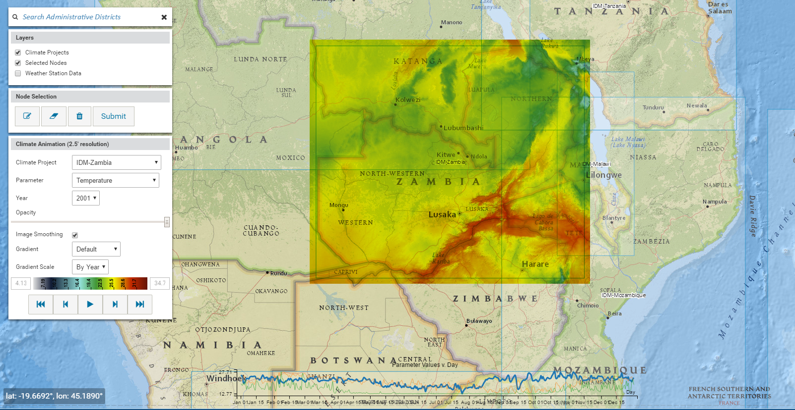

# Climate and demographics spatial data

Climate is especially important in vector models, as it is a key determinant of the geographic
distribution and seasonality of malaria. Climate, which includes rainfall, temperature, and
humidity, directly influences availability of larval habitat,  determines mosquito developmental and
survival rates, and impacts human behavior that leads to contact with infectious mosquitoes.

This framework explores the impact of different locations and weather patterns in single
*node* and multi-node geographies. It explores demographics data for births, deaths, age
initialization and immunity. Climate and demographics spatial data is configured for a geographic
location, such as a rainfall-driven larval habitat, to create a climate-based distribution model of
malaria transmission. The seasonality of species abundances are considered, as are rainfall,
temperature, humidity and larval dynamics. Mosquito species and seasonality are depicted
by habitat preferences that are, for example, temporary, semi-permanent or permanent.

Clearly, climate and habitat type are inextricably linked. However, it is possible to have several
types of habitat within a given climate region; for this reason, climate is configured separately
from  habitat type.  You may choose from a variety of options to configure climate, ranging from
pre-set classification systems to uploaded user data. Further,  it is possible to enable
stochasticity in climate as well as in rainfall patterns. For example,  rainfall data may be based
off of monthly totals averaged per day. In the simulation configuration file, the parameter
**Enable_Rainfall_Stochasticity** will set up daily rainfalls drawn from an exponential distribution
with the same daily mean. This preserves approximate monthly totals, but produces a more realistic
rainfall pattern for the simulation. For more information on how to configure climate, see
[software-climate](software-climate.md). And for more information on the particular habitat types that are configurable
in EMOD see [vector-model-larval-habitat](vector-model-larval-habitat.md).

*The EMOD vector model utilizes site-specific climate and demographics data to accurately simulate vector transmission in a given geographic location.*

For a complete list of demographics parameters, go to [parameter-demographics](parameter-demographics.md).

## Relevant IDM publications on spatial models

* Nikolov, *et al*., 2016. [Malaria Elimination Campaigns in the Lake Kariba Region of Zambia: a Spatial Dynamical Model](http://journals.plos.org/ploscompbiol/article?id=10.1371/journal.pcbi.1005192). *PLOS Computational Biology*.

* Marshall, *et al*., 2016. [Key traveler groups of relevance to spatial malaria transmission: a survey of movement   patterns in four sub-Saharan African countries](http://malariajournal.biomedcentral.com/articles/10.1186/s12936-016-1252-3).
  *Malaria Journal*. 15(200)

* Gerardin, *et al*., 2016. [Optimal Population-Level Infection Detection Strategies for Malaria Control and Elimination   in a Spatial Model of Malaria Transmission](http://journals.plos.org/ploscompbiol/article?id=10.1371/journal.pcbi.1004707).
  *PLOS Computational Biology*.

* Eckhoff, *et al*., 2015. [From puddles to planet: modeling approaches to vector-borne diseases at varying resolution and scale](http://www.sciencedirect.com/science/article/pii/S2214574515000802). *Current Opinion in Insect Science*. 10:118-123
