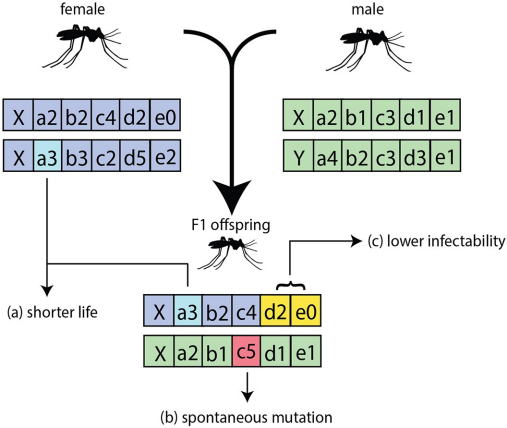
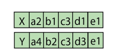

================
Vector genetics
================

Vector control interventions such as insecticide-treated nets (ITNs) and indoor residual spraying
(IRS) are cornerstones of malaria control and elimination efforts. However, the growing spread of
insecticide resistance in mosquito populations threatens to undermine these tools. In parallel,
new strategies such as gene drives — genetic elements that bias their own inheritance to spread
through a population within a few generations — have been proposed as a way to either suppress
vector populations or replace them with vectors that are unable to transmit malaria.

|EMOD_s|'s vector genetics system provides a stochastic, agent-based framework for simulating
the inheritance and phenotypic effects of genetic loci in mosquito populations. Each mosquito
carries a diploid genome composed of up to 9 genetic loci with up to 8 alleles per locus. The
system supports Mendelian inheritance, germline mutations, insecticide resistance, gene drives,
sex-ratio distortion, and releases of genetically modified mosquitoes — all operating within the
standard vector lifecycle described in :doc:`vector-model-transmission`. This allows researchers
to investigate the spread of insecticide resistance, evaluate gene drive deployment strategies,
and explore the interaction between vector genetics and malaria transmission in a spatially and
temporally explicit setting.

For more details on the modeling approach and example applications, see Selvaraj et al. (2020),
`Vector genetics, insecticide resistance and gene drives: An agent-based modeling approach to
evaluate malaria transmission and elimination <https://doi.org/10.1371/journal.pcbi.1008121>`_.

   Overview of the vector genetics system in |EMOD_s|: a female and male each carry a diploid
   genome; the F1 offspring inherits one gamete from each parent. The labels illustrate three
   consequences modeled by the genetics system: (a) allele combinations can modify phenotypic
   traits such as lifespan (see :ref:`trait-modifiers`), (b) spontaneous germline mutations can
   introduce new allele variants (see :ref:`germline-mutations`), and (c) allele combinations can
   alter vector competence such as infectability (see :ref:`trait-modifiers`). From Selvaraj
   et al. (2020), `doi:10.1371/journal.pcbi.1008121 <https://doi.org/10.1371/journal.pcbi.1008121>`_.

Vector genetics is configured per species under ``Vector_Species_Params`` in config.json. Each
species defines its own set of genes, alleles, trait modifiers, and (optionally) gene drives.
The system does not require a separate simulation type — it is available whenever the simulation
includes vector population dynamics (``Simulation_Type`` set to VECTOR_SIM or MALARIA_SIM).

Genome representation
=====================

Each mosquito carries a diploid genome composed of two gametes — one inherited from each parent.
The genome supports up to 8 user-defined genetic loci, each with up to 8 named alleles. A
mosquito's Wolbachia status and microsporidia strain are also tracked per individual alongside
the genetic information.

   Example diploid genome: two gametes (rows), each carrying one allele per locus. The first
   column is the gender locus; the remaining columns are user-defined genes with named alleles.

One locus is always reserved as the gender gene. A mosquito's sex is always determined by the
gender gene — this is true even in simulations that do not use the genetics system. In a standard
simulation the gender gene has just two alleles (X and Y), but it can be configured with
additional alleles to support gene drive scenarios such as sex-ratio distortion, where a drive
element on the X chromosome suppresses Y-bearing sperm.

Genes and alleles
=================

Genes are defined in the ``Genes`` array within each species' configuration. Each gene declares a
set of named alleles with initial population frequencies to be used at simulation initialization.

.. code-block:: json

    "Vector_Species_Params": [
        {
            "Name": "gambiae",
            "Genes": [
                {
                    "Is_Gender_Gene": 1,
                    "Alleles": [
                        { "Name": "X", "Initial_Allele_Frequency": 0.75, "Is_Y_Chromosome": 0 },
                        { "Name": "Y", "Initial_Allele_Frequency": 0.25, "Is_Y_Chromosome": 1 }
                    ]
                },
                {
                    "Alleles": [
                        { "Name": "a0", "Initial_Allele_Frequency": 0.9, "Is_Y_Chromosome": 0 },
                        { "Name": "a1", "Initial_Allele_Frequency": 0.1, "Is_Y_Chromosome": 0 }
                    ]
                }
            ]
        }
    ]

**Gender gene**: If defined, the gender gene must be listed first. It partitions alleles into
X-chromosome alleles (``Is_Y_Chromosome`` = 0 (false)) and Y-chromosome alleles
(``Is_Y_Chromosome`` = 1 (true)). If no gender gene is explicitly defined, |EMOD_s| creates a default
one with a single X allele and a single Y allele, with XX and XY combinations being generated at
about 50/50 frequencies.

**Constraints**: Allele names must be unique across all genes within a species. Frequencies within
a gene must sum to 1.0. A species may define at most 9 genes (including the gender gene) and at
most 8 alleles per gene.

When the simulation initializes, the vector population is seeded with genomes drawn from the
configured allele frequencies. Each gamete's alleles are sampled independently at each locus, then
maternal and paternal gametes are combined to produce diploid genomes. The resulting genotype
frequencies follow Hardy-Weinberg expectations.

Genetic diversity
-----------------

Keep the following in mind when deciding how much genetic diversity to define for your vector
population:

- **Initial population size**: If you want high genetic diversity in the initial population, the
  initial adult population must be large enough to represent that diversity. For example, if you
  define enough genes and alleles to produce 100,000 possible genome combinations but only
  initialize 10,000 mosquitoes, many combinations will simply not be present. Population size also
  needs to be sufficient that stochastic effects such as daily mortality do not eliminate rare
  alleles before the population becomes established.

- **Runtime cost**: Greater genetic diversity — even if introduced later via a release —
  increases simulation run time. More distinct genomes mean more objects to track and process at
  each time step.

Mating
======

Alleles are spread through the population via mating. Females mate exactly once in their
lifetime, when they transition from immature to adult. Males are available for mating every day.
During the immature-to-adult transition, immature males are updated first to determine how many
of each genome are available in the male queue. Female cohorts then select mates randomly from
the available males, weighted by population count.

Each female stores her mate's genome for the duration of her life. When she completes a feeding
cycle and is ready to oviposit, the stored mate genome is used to determine offspring genotypes
through the fertilization process described below.

Mendelian inheritance
=====================

During fertilization, each parent contributes one gamete to the offspring through standard
Mendelian segregation: at each locus, one of the two parental alleles is selected with equal
(50/50) probability, and loci segregate independently. Females always contribute an X-bearing
gamete; males contribute either X or Y, with the ratio controlled by the ``FEMALE_EGG_RATIO``
trait modifier. All possible gamete combinations are enumerated, each assigned a probability
equal to the product of the two gamete probabilities, and eggs are distributed across these
combinations stochastically. Offspring sharing the same genome are grouped into cohorts and
enter the standard egg-to-adult development pipeline.

The following diagram shows the full sequence of events during fertilization, including when gene
drive, germline mutation, and maternal deposition are applied relative to gamete creation:

.. uml::

    @startuml
    skinparam defaultFontSize 12
    skinparam activityFontSize 12
    skinparam activityArrowFontSize 11
    skinparam backgroundColor white

    start

    :Input: female genome, male genome, total egg count;

    fork
        :**Gene Drive — Female**
        DriveGenes(female)
        Expands female genome into a set of
        weighted genome-probability pairs.
        Drives alleles across chromosomes
        before gamete creation.;
    fork again
        :**Gene Drive — Male**
        DriveGenes(male)
        Expands male genome into a set of
        weighted genome-probability pairs.
        Drives alleles across chromosomes
        before gamete creation.;
    fork again
        :**Get FEMALE_EGG_RATIO modifier**
        Read from male genome trait modifiers.
        Adjusts the ratio of X-bearing to
        Y-bearing sperm (affects sex ratio
        of offspring).;
    end fork

    fork
        :**Create Female Gametes**
        Mendelian segregation: 50/50 probability
        of inheriting either allele at each locus.
        Wolbachia infection status is passed
        through female gametes only.;
    fork again
        :**Create Male Gametes**
        Mendelian segregation: 50/50 probability
        of inheriting either allele at each locus.
        X vs Y gamete ratio adjusted by the
        FEMALE_EGG_RATIO modifier.;
    end fork

    fork
        :**Germline Mutation — Female Gametes**
        For each allele with defined mutations:
        new gametes are added at the mutation
        frequency and the original gamete
        probability is reduced accordingly.;
    fork again
        :**Germline Mutation — Male Gametes**
        For each allele with defined mutations:
        new gametes are added at the mutation
        frequency and the original gamete
        probability is reduced accordingly.;
    end fork

    fork
        :**Maternal Deposition — Female Gametes**
        Using the mother's genome, pre-calculate
        allele changes due to maternal Cas9
        deposition (e.g. gene drive cargo
        deposited into eggs).;
    fork again
        :**Maternal Deposition — Male Gametes**
        Using the mother's genome, pre-calculate
        allele changes due to maternal Cas9
        deposition. Applied to both gamete
        sets using the mother's genome.;
    end fork

    :**Create Possible Egg Genomes**
    Combine all female gametes x all male gametes.
    Each combination's probability =
    female_gamete_prob x male_gamete_prob.
    Zero-probability combinations are discarded.;

    :**Adjust for Non-Fertile Eggs**
    Apply the ADJUST_FERTILE_EGGS trait modifier
    to each possible genome's probability.
    Reduces the likelihood of non-viable
    genome combinations.;

    :**Determine Egg Counts**
    For each possible genome, multiply its
    probability by totalEggs to get a
    stochastic count.;

    :Output: fertilized eggs (genome to count pairs);

    stop
    @enduml

.. _germline-mutations:

Germline mutations
==================

Alleles can mutate during gametogenesis, producing new allele variants in offspring at a
configured per-generation rate. Mutations are defined per gene:

.. code-block:: json

    "Genes": [
        {
            "Alleles": [
                { "Name": "a0", "Initial_Allele_Frequency": 0.95 },
                { "Name": "a1", "Initial_Allele_Frequency": 0.05 }
            ],
            "Mutations": [
                {
                    "Mutate_From": "a0",
                    "Mutate_To": "a1",
                    "Probability_Of_Mutation": 0.005
                }
            ]
        }
    ]

When gametes are created, each allele has the configured probability of mutating to the specified
target. The mutation is applied after standard Mendelian segregation but before fertilization.
Multiple mutations can be defined for a single gene, including bidirectional mutations.

Note that germline mutation acts on gametes, not the parent genome. New mutant gametes are added
at the defined frequency, and the probability of the original (unmutated) gamete is reduced by
the same amount, so total probability is conserved.

.. _trait-modifiers:

Trait modifiers
===============

Trait modifiers map allele combinations to phenotypic effects. They are the mechanism by which
genotype influences mosquito biology — controlling traits such as mortality, fecundity,
insecticide susceptibility, and parasite transmission.

Each modifier specifies one or more ``Allele_Combinations`` (the genotypes it applies to) and one
or more ``Trait_Modifiers`` (the traits it affects and by how much):

.. code-block:: json

    "Gene_To_Trait_Modifiers": [
        {
            "Allele_Combinations": [
                [ "a1", "a1" ]
            ],
            "Trait_Modifiers": [
                { "Trait": "MORTALITY", "Modifier": 1.5 }
            ]
        }
    ]

In this example, mosquitoes homozygous for ``a1`` at a given locus have 1.5x the baseline
mortality rate.

**Allele combination syntax**: Each combination is a list of allele names — two per locus (one for
each gamete). ``"*"`` acts as a wildcard matching any allele. For a gene with alleles ``a0`` and
``a1``:

- ``["a1", "a1"]`` — matches only ``a1/a1`` homozygotes
- ``["a1", "*"]`` — matches any mosquito carrying at least one ``a1`` allele
- ``["*", "*"]`` — matches all genotypes (wildcard at both positions)

Multi-locus combinations list allele pairs for each relevant locus. Loci not mentioned are treated
as wildcards.

When multiple modifiers apply to the same trait for a given genome, their values are multiplied
together.

Available traits
----------------

The following traits can be modified by genotype:

.. csv-table::
    :header: Trait, Default modifier, Description
    :widths: 12, 8, 35

    INFECTED_BY_HUMAN, 1.0, "Multiplier on the probability that a mosquito becomes infected when feeding on an infectious human. Applied to the species-level ``Acquire_Modifier`` parameter."
    FECUNDITY, 1.0, "Multiplier on the number of eggs laid per oviposition. Applied to the ``Egg_Batch_Size`` parameter. This impacts egg count before egg crowding takes effect."
    FEMALE_EGG_RATIO, 1.0, "Controls the sex ratio of offspring. A value of 1.0 produces 50/50 male/female. Values above 1.0 bias toward female; values below 1.0 bias toward male. At 2.0 all offspring are female; at 0.0 all are male. Applied during fertilization after egg crowding."
    STERILITY, 1.0, "Determines if eggs are viable based on the parents' genomes. A value of 0.0 means the vector is sterile — if either parent is sterile, the eggs are not viable and are not added to the egg queue. Any nonzero value means fertile. Applied after egg crowding. Sterility does not impact mating. If the female mates with a sterile male, then she will feed as normal but produce no eggs."
    TRANSMISSION_TO_HUMAN, 1.0, "Multiplier on the probability that sporozoites in the salivary gland successfully infect a human during a bite. Applied to the species-level ``Transmission_Rate`` parameter."
    ADJUST_FERTILE_EGGS, 1.0, "Multiplier on the probability of each genome's eggs being fertile. This is the last step in the fertilization process before actual numbers of eggs are assigned. A value of 0.0 means no eggs are produced; 1.0 means no change; values above 1.0 increase egg production for that genome."
    MORTALITY, 1.0, "Multiplier on the daily mortality rate, where the base rate is ``1/Adult_Life_Expectancy`` (or ``1/Male_Life_Expectancy`` for males). Values above 1.0 increase mortality (shorter lifespan); values below 1.0 decrease it."
    INFECTED_PROGRESS, 1.0, "Multiplier on the daily progression from infected to infectious (oocyst-to-sporozoite conversion rate)."
    OOCYST_PROGRESSION, 1.0, "Additional multiplier on temperature-dependent oocyst maturation. Only applies when the vector carries a parasite matching a specified barcode (requires Full Parasite Genetics). This is an additional multiplier on top of INFECTED_PROGRESS."
    SPOROZOITE_MORTALITY, 1.0, "Multiplier on sporozoite death rate within the vector. Only applies when the vector carries a parasite matching a specified barcode (requires Full Parasite Genetics)."

.. _insecticide-resistance:

Insecticide resistance
======================

Insecticide resistance is modeled through the interaction of vector genotype with insecticide
properties. Each insecticide in the simulation defines resistance profiles that specify which
allele combinations confer resistance and how much protection they provide.

Please see :doc:`vector-model-insecticide-resistance` for more information on configuring insecticide resistance.

.. _gene-drives:

Gene drives
===========

Gene drives are genetic elements that bias their own inheritance, spreading through a population
at rates exceeding standard Mendelian expectations. |EMOD_s| supports five gene drive types, each
modeling a different mechanism.

Note that gene drive is applied before gamete creation. A single parent genome is first expanded
into a set of weighted genome-probability pairs by the drive, and Mendelian segregation then
operates on those possibilities.

Please see :doc:`vector-model-gene-drives` for more information on configuring gene drives.

.. _maternal-deposition:

Maternal deposition
===================

Maternal deposition models the transfer of Cas9 protein (not DNA) from mother to offspring,
generating resistance alleles in the embryo before the drive's homology-directed repair is
active. It extends gene drive behavior by adding a pre-embryonic cutting step configured in the
``Maternal_Deposition`` array within ``Vector_Species_Params``.

Note that maternal deposition uses the mother's genome to modify both the female and male gamete
sets. The Cas9-driven allele changes originate from the mother regardless of which set of gametes
is being modified.

Please see :doc:`vector-model-maternal-deposition` for full details on how maternal deposition
works, configuration parameters, and validation rules.

Wolbachia
=========

*Wolbachia* is an intracellular bacterium found naturally in many insect species and can be
introduced into mosquito populations as a disease-control strategy. In *Anopheles* mosquitoes,
Wolbachia infection can shorten adult lifespan — important because malaria parasites (*Plasmodium*)
require 10–14 days to develop inside the mosquito before it can transmit disease, so a shorter
lifespan means fewer mosquitoes survive long enough to become infectious. Wolbachia can also inhibit
*Plasmodium* development directly by activating the mosquito immune system and competing with
the parasite for resources. A key feature of Wolbachia for population-level strategies is
cytoplasmic incompatibility: infected males cannot successfully reproduce with uninfected females,
which causes Wolbachia to spread through a population over time once introduced. Together, these
effects — reduced lifespan, parasite inhibition, and self-sustaining spread — make Wolbachia a
candidate tool for reducing malaria transmission without eliminating mosquitoes.

|EMOD_s| models four Wolbachia states per vector: none, strain A, strain B, or both strains A and B.

Wolbachia is inherited maternally — infected females pass their Wolbachia status to all offspring
through the egg cytoplasm. Males do not transmit Wolbachia.

Wolbachia-infected males are incompatible with uninfected females: matings between Wolbachia-
carrying males and uninfected females produce inviable eggs (cytoplasmic incompatibility). This
is checked during egg laying, and incompatible crosses produce no eggs.

Wolbachia modifies vector biology through two parameters: ``Wolbachia_Mortality_Modification``
is a multiplier on the mortality rate of infected vectors, and ``Wolbachia_Infection_Modification``
is a multiplier on the probability that a Wolbachia-infected vector acquires a malaria infection
when biting an infectious human. A value below 1.0 reduces susceptibility, modeling the parasite-
blocking effect of Wolbachia; the default of 1.0 means no effect.

Vectors with specific Wolbachia status can be introduced into the population using the
``MosquitoRelease`` intervention with the ``Released_Wolbachia`` parameter.

Releasing vectors with specific genomes
========================================

The ``MosquitoRelease`` intervention introduces vectors with user-specified genomes into the
simulation. This is the primary mechanism for modeling releases of genetically modified
mosquitoes, including gene drive carriers and sterile males. Released vectors can also be given
a specific Wolbachia status (via ``Released_Wolbachia``) or a microsporidia strain (via
``Released_Microsporidia_Strain``). The user specifies the complete genome of the released
vectors — all genes and loci must be specified, including sex (via the appropriate X/Y
chromosome pair).

When gene drive alleles are released, the drive mechanics take effect during subsequent mating
and fertilization events, propagating the driven alleles through the population.

See :doc:`parameter-campaign-node-mosquitorelease` for more information on configuring mosquito releases.

Output
======

:doc:`software-report-vector-genetics` (``ReportVectorGenetics``) is the primary report for
tracking vector genetics. It produces a CSV file with vector counts stratified by genome, allele,
or allele frequency at each time step, node, and vector state (eggs, larvae, immature, adult,
infected, infectious, male).

