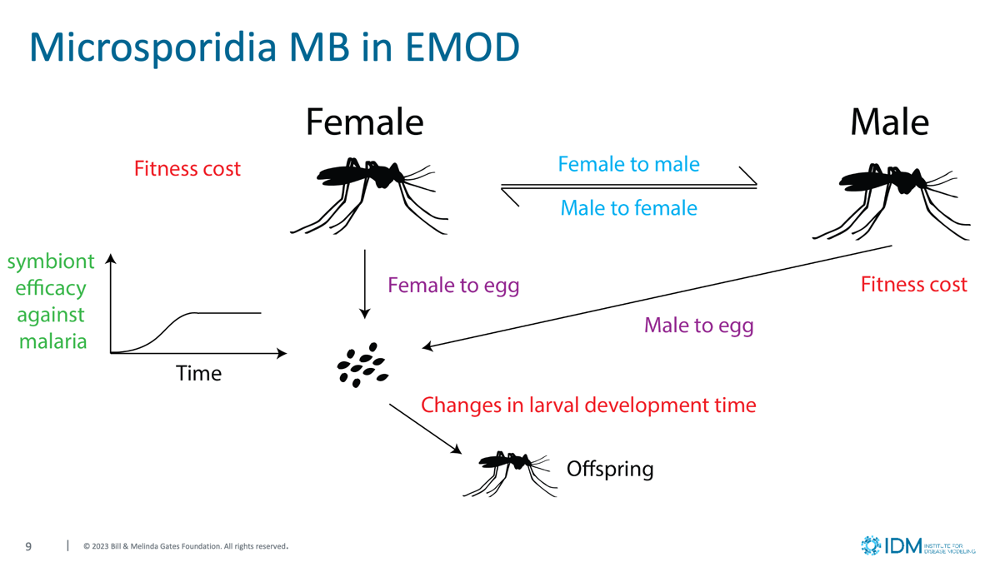

=============================
Microsporidia Infection Model
=============================

The model extends the standard VECTOR_SIM model to track endosymbiont infections and their
effects in mosquito vectors throughout the complete lifecycle — from larval infections through
adult transmission events to vertical transmission to offspring.

Although this model was originally created to study Microsporidia MB and its impact on malaria
transmission dynamics, it can represent any endosymbiont that spreads between vectors horizontally
(during mating) or vertically (from parent to offspring) and reduces the vector's ability to
acquire or transmit disease. The framework is not limited to microsporidia — it can model
*Wolbachia*-like symbionts, engineered bacteria, or other intracellular organisms with similar
transmission and disease-blocking characteristics.

In the following sections, we will refer to the modeled endosymbionts as "microsporidia" for simplicity, and
vector-borne diseases as "malaria", but the framework applies broadly to any vector-endosymbiont-disease system
with similar dynamics.

The microsporidia model implements four core transmission processes:

   Microsporidia transmission and disease interference in the vector lifecycle

- **Vertical transmission**: Infected parents transmit microsporidia to their offspring through both maternal (female-to-egg) and paternal (male-to-egg) routes with strain-specific probabilities.
- **Horizontal transmission**: Adult-to-adult transmission occurs during mating, with infected males and females transmitting their strain to uninfected partners at configurable rates.
- **Multi-strain dynamics**: The model supports up to 3 distinct microsporidia strains per mosquito species, each with independent transmission parameters and phenotypic effects.
- **Malaria interference**: Microsporidia infection modifies mosquito susceptibility to malaria acquisition and transmission through time-dependent immunity effects.

Some of the model limitations include:

- **Maximum strain count**: Limited to 3 microsporidia strains per species.
- **Fixed transmission probabilities**: Transmission rates are constant and do not vary with environmental conditions or vector age
- **No co-infection dynamics**: Each vector can carry only one microsporidia strain; competitive exclusion is absolute
- **Simplified immunity**: Malaria interference effects are time-dependent but do not account for dose-response relationships or microsporidia load

What are microsporidia?
=======================

Microsporidia are a diverse group of obligate intracellular eukaryotic parasites that infect a wide range of hosts, including insects. In mosquitoes, certain microsporidia species (such as Microsporidia MB) have been identified as naturally occurring symbionts that can dramatically reduce malaria transmission. These parasites are particularly attractive for biocontrol applications because they:

- Are vertically transmitted from parents to offspring, ensuring persistence in mosquito populations
- Significantly impair *Plasmodium* development and transmission without severely compromising mosquito fitness
- Can be artificially introduced into wild mosquito populations through targeted release programs
- Provide a transmission-blocking mechanism that complements other malaria control strategies

Field studies have shown that microsporidia-infected *Anopheles* mosquitoes are significantly less likely to become infected with *P. falciparum* and, when infected, rarely develop sporozoites capable of transmission. This makes microsporidia an important tool for understanding and potentially controlling malaria transmission dynamics.

Why model microsporidia?
========================

Modeling microsporidia infections is essential for:

**Evaluating biocontrol strategies**: Microsporidia-based interventions could involve releasing infected mosquitoes to establish symbiont infections in wild populations. Models help predict the conditions under which such releases would be successful and sustainable.

**Optimizing intervention timing and coverage**: The model can evaluate how release timing, coverage levels, and strain characteristics affect the establishment and persistence of transmission-blocking microsporidia.

**Assessing combined intervention effects**: Microsporidia work synergistically with other vector control measures. Models help predict how microsporidia-based interventions interact with insecticides, bed nets, and other malaria control tools.

**Understanding natural transmission dynamics**: Wild mosquito populations often harbor microsporidia at moderate prevalences. Understanding how these infections spread and persist helps explain natural variation in malaria transmission intensity and seasonal patterns.

**Strain selection and optimization**: By comparing different microsporidia strains with varying transmission characteristics and phenotypic effects, models can guide the selection of optimal strains for field deployment.

Genome representation
=====================

Microsporidia infections are tracked using a field within the vector genome, allowing for up to 4 states per mosquito (no infection plus 3 distinct strains). The infection state is encoded as an index where:

- **Index 0**: No microsporidia infection
- **Indices 1-3**: Infection with microsporidia strain 1, 2, or 3 respectively

Each strain has a unique name (``Strain_Name``) and an independent parameter set. Strain names must be unique across all species. Vector may only be infected with one microsporidia strain and, once infected, is infected for life.

Transmission mechanisms
=======================

Inter-population transmission
-----------------------------
When vector migration is used, microsporidia infections migrate with their hosts, enabling
spatial spread modeling between different vector populations and metapopulation analysis.
The model does not currently include environmental transmission pathways (e.g., spore contamination of larval habitats)
beyond the **LarvalMicrosporidiaIntervention**, see :ref:`larval-microsporidia-intervention` below for details.

Intra-population transmission
-----------------------------
The model implements three distinct within population transmission pathways that operate according to empirically derived probabilities:

Adult-to-adult
--------------
During mating, microsporidia can transmit between adult mosquitoes through two pathways:

**Male-to-female transmission**: When an infected male mates with an uninfected female, transmission occurs with probability set by the ``Male_To_Female_Transmission_Probability`` parameter. 

**Female-to-male transmission**: When an infected female mates with an uninfected male, transmission occurs with probability set by the ``Female_To_Male_Transmission_Probability`` parameter.

If both partners are already infected (regardless of strain), no additional transmission occurs. 

Adult-to-egg
------------

Microsporidia transmit from infected parents to their offspring through vertical transmission pathways:

**Female-to-egg transmission**: Infected females transmit microsporidia to their eggs with probability defined by the ``Female_To_Egg_Transmission_Probability`` parameter. 

**Male-to-egg transmission**: Males can also transmit microsporidia to eggs through infected sperm with probability defined by the ``Male_To_Egg_Transmission_Probability`` parameter, independent of female infection status. 

When both parents are infected, the combined transmission probability is calculated as:

.. math::
    P_{combined} = 1 - (1 - P_{female}) \times (1 - P_{male})

For eggs that become infected through this combined mechanism, the strain is determined by the relative contribution of each parent:

.. math::
    P_{female\_strain} = \frac{P_{female}}{P_{female} + P_{male}}

    P_{male\_strain} = 1 - P_{female\_strain}

The model uses binomial approximation to determine how many eggs become infected and which strain they carry.

Larval habitat seeding
----------------------

Microsporidia can also be introduced directly into larval habitats through the **LarvalMicrosporidiaIntervention**.
This intervention mimics environmental seeding of water bodies with microsporidia spores, allowing larvae to become
infected through ingestion or contact with contaminated water. See :ref:`larval-microsporidia-intervention` below for details.

Phenotypic effects
==================

Microsporidia infection affects multiple aspects of mosquito biology, with effects varying by strain:

Larval development
------------------

**Growth rate modification**: The ``Larval_Growth_Modifier`` parameter adjusts the daily larval growth rate. Values greater than 1.0 accelerate development (as observed with Microsporidia MB), while values less than 1.0 slow development.

Adult mortality
---------------

**Female mortality effects**: The ``Female_Mortality_Modifier`` adjusts female adult mortality rates. Values greater than 1.0 increase mortality (shorter lifespan), while values less than 1.0 decrease mortality.

**Male mortality effects**: The ``Male_Mortality_Modifier`` similarly adjusts male adult mortality rates independently from female effects.

Laboratory studies with Microsporidia MB have shown minimal impact on adult survival, but the model allows for strain-specific effects that may differ from field observations.

Malaria transmission interference
---------------------------------

Microsporidia's primary value for malaria control lies in their ability to interfere with *Plasmodium* development and transmission:

**Malaria Acquisition interference**: The ``Duration_To_Disease_Acquisition_Modification`` parameter defines how microsporidia infection affects the probability that a female mosquito becomes infected with malaria when feeding on an infectious human. This is specified as a time-dependent modifier using an dictionary with **Times** and **Values** keys, where:

- **Times**: Array of days since microsporidia infection (ascending order)
- **Values**: Array of probability multipliers (0-1) for malaria acquisition

**Malaria Transmission interference**: The ``Duration_To_Disease_Transmission_Modification`` parameter similarly affects the probability that an infected mosquito successfully transmits malaria when biting a susceptible human. This captures scenarios where mosquitoes acquire malaria before becoming infected with microsporidia.

- **Times**: Array of days since microsporidia infection (ascending order)
- **Values**: Array of probability multipliers (0-1) for malaria transmission

For example, newly infected mosquitoes might show no acquisition or transmission interference (multiplier = 1.0), but interference increases over time as the microsporidia establish infection, reaching maximum effect (multiplier = 0.0) after several days. The model uses linear interpolation to calculate values for times not explicitly defined, with times greater than maximum time defined maintaining the last value of the map.

Configuration parameters
========================

Microsporidia strains are configured within the **Vector_Species_Params** section as an array called
**Microsporidia**. Each array element defines one strain with the following parameters.

.. include:: ../reuse/warning-case.txt

.. csv-table::
    :header: Parameter, Data type, Minimum, Maximum, Default, Description, Example
    :widths: 10, 5, 5, 5, 5, 20, 5
    :file: ../csv/config-vector-microsporidia-malaria.csv

The following example shows a two-strain microsporidia configuration for *Anopheles gambiae*.

.. literalinclude:: ../json/config-vector-microsporidia.json
   :language: json

Interventions
=============

.. _larval-microsporidia-intervention:

LarvalMicrosporidiaIntervention
-------------------------------

The **LarvalMicrosporidiaIntervention** provides a mechanism for introducing microsporidia into larval habitats, simulating environmental release programs or natural habitat contamination. This node-level intervention can target specific habitat types and applies configurable infectivity that may decay over time.

See :doc:`parameter-campaign-node-larvalmicrosporidiaintervention` for details.

MosquitoRelease intervention
----------------------------

Microsporidia can also be introduced through the **MosquitoRelease** intervention by specifying the ``Released_Microsporidia_Strain`` parameter with the desired strain name. This allows for targeted release of infected adult mosquitoes to establish microsporidia in wild populations.

See :doc:`parameter-campaign-node-mosquitorelease` for details.

Output and reporting
====================

The microsporidia model extends several existing reports and adds a dedicated report to track
infection dynamics:

- :doc:`software-report-vector-stats` — When ``Include_Microsporidia_Columns`` is enabled, adds
  columns partitioning vector counts by microsporidia status
  (``HasMicrosporidia-STATE_XXX`` / ``NoMicrosporidia-STATE_XXX``), providing temporal and spatial tracking of
  how microsporidia infections spread through vector populations.

- :doc:`software-report-microsporidia` — A specialized report focusing exclusively on
  microsporidia dynamics, tracking infection prevalence by strain across vector life stages and
  monitoring strain competition dynamics.

When vector migration is enabled, microsporidia infections migrate with their hosts, enabling
spatial spread modeling and metapopulation analysis.

Implementation notes
====================

Performance considerations
--------------------------

The microsporidia model adds computational overhead through:

- **Adult mating algorithms**: Pairing males and females for transmission calculations requires more complex mating logic than the base model
- **Multi-strain tracking**: Maintaining separate cohorts for different microsporidia strains increases memory usage and computational complexity
- **Time-dependent effects**: Evaluating time-since-infection modifiers for disease interference requires additional calculations per vector per timestep
