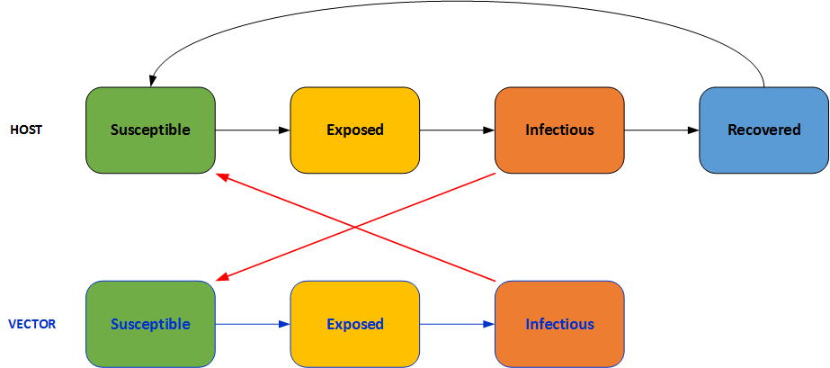
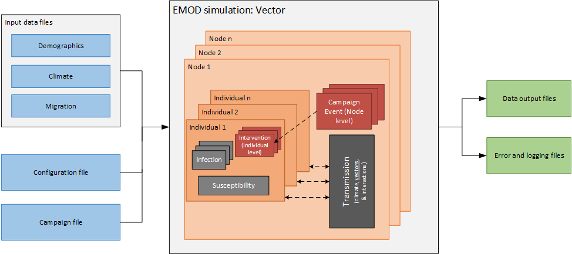
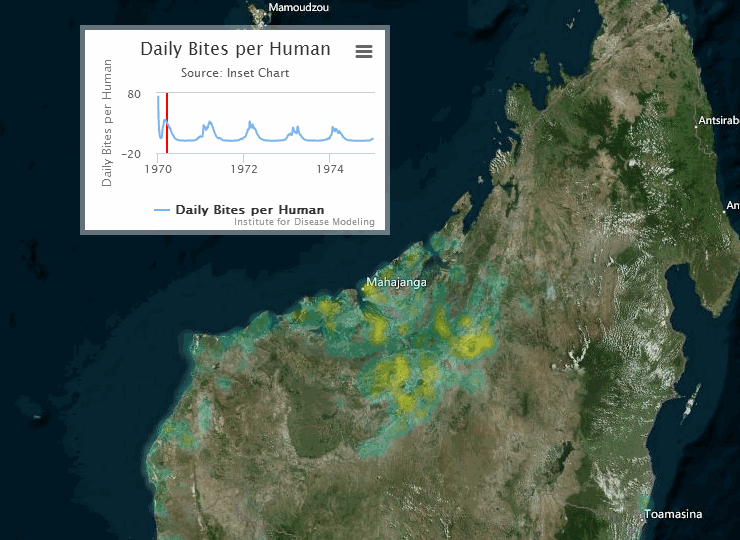

# Vector biology

The EMOD vector model inherits the generic model functionality and introduces vector
transmission and mosquito population dynamics. Interventions can be deployed within simulations for
a variety of transmission settings with different transmission intensities, vector behaviors, and
seasonally-driven ecologies. Climate data is necessary to simulate the effect of climatalogical
impacts on vector biology. To use the vector model, set the configuration parameter
**Simulation_Type** to VECTOR_SIM.

The figure below demonstrates the main components of the vector EMOD *simulation type*.

Vectors add a level of complexity to the interactions, as pathogens are transmitted via vector -
human - vector. For a vector-borne disease, the SEIR model would appear as follows.

While EMOD is an agent-based model, both the simulated humans and vectors move through the
various infection states analogously to the compartmental model illustrated above. 

The core of the simulation consists of *solvers* for mosquito population dynamics and pathogen
transmission to and from the human host population. While the human population is fully
individual-based, the mosquito population can be represented by discrete cohorts or individual agent
mosquitoes. As an agent-based model, interactions between humans and vectors advance during each
time step. The mosquito population is advanced, for example, through discrete 1-day time steps
during which mosquitoes may engage in host-seeking or feeding behaviors, mating, maturation through
a life-stage, or even death. Successful feeds on humans can result in infection of the human host,
or conversely, susceptible mosquitoes may become infected from an infectious human.

## Model implementation structure

There are two categories of possible implementations of the basic model, each with different
computational efficiencies, resolutions, and flexibilities. The first is an individual model, where
it simulates every individual mosquito in the population or can utilize a sampled subset
of mosquitoes to represent the population as the whole. The second is a modified cohort
simulation, with or without explicit mosquito ages.

### Individual mosquito model

This basic model can be implemented through simulation of every individual mosquito, or by
simulation of a subset of individual mosquitoes to represent the full population. Each mosquito's
state contains status (susceptible, latently infected, and infectious), timers for transition to
adult from immature and infected to infectious, mating status and *Wolbachia* infection, and
age. An *oviposition* timer to enforce a fixed feeding cycle may be included as well. If
mosquitoes are sampled and a subset used to represent the local population, each sampled mosquito
will have an associated sampling weight as well. To use this model, set the **Vector_Sampling_Type**
parameter to TRACK_ALL_VECTORS or SAMPLE_IND_VECTORS. See [parameter-configuration-sampling](parameter-configuration-sampling.md) parameters for more
information.

### Cohort model

In the modified cohort simulation, rather than representing the entire population by three
compartments for susceptible, latently infected, and infectious mosquitoes, the simulation
dynamically allocates a cohort for every distinct state, and the cohort maintains the count of all
mosquitoes in that state. For the cohort simulation with explicit ages, in order
to allow modeling of senescence, mosquito age is part of the state definition, and many more cohorts
are required to represent the population. To use this model, set the **Vector_Sampling_Type**
parameter to VECTOR_COMPARTMENTS_NUMBER or VECTOR_COMPARTMENTS_PERCENT. See [parameter-configuration-sampling](parameter-configuration-sampling.md)
parameters for more information.

## Spatial-scale dynamics and migration

Extensive multi-*node* simulations with location-specific climate, intervention deployments,
larval habitat, and migration may be configured within the EMOD framework. Nodes can be
configured to best represent the spatial scale being simulated: a node can be at the household
level, village level, county level, national level, or other desired geographic scale. Migration can
be enabled between nodes (for both humans and mosquitoes), such that EMOD can most accurately
represent the dynamics of the location. By varying spatial-scale resolution, relevant factors for
transmission dynamics can be more clearly elucidated. For information on configuring nodes and
migration parameters, see [parameter-configuration-migration](parameter-configuration-migration.md).

The following visualization shows an example of a gridded representation of malaria transmission on
the island of Madagascar.

The following pages in this section describe the structural components of the vector model.
