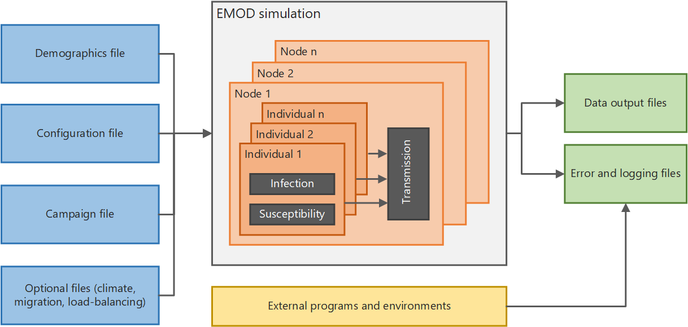

# EMOD input files

Every EMOD simulation is driven by a set of input files. Understanding what each file controls
will help you follow the tutorial scripts.

## Configuration file

`config.json` contains the simulation-wide settings: how long to run, which disease model to
use, vector species, transmission parameters, and hundreds of other options. In the tutorials,
`build_config(config)` is the callback that builds this file. It starts from a validated set of
malaria defaults and then applies the changes specific to each tutorial.

## Demographics file

The demographics file describes the human population: how many people, their initial age
distribution, birth and death rates, and geographic node layout. In the tutorials,
`build_demog()` builds this file. All tutorials use a single node of 1000 people with
equilibrium vital dynamics and a sub-Saharan Africa age structure.

## Campaign file

The campaign file defines interventions — what to deploy, to whom, and when. Each intervention
event specifies a trigger, a target population, and an intervention class (bednet, drug, vaccine,
etc.). In the tutorials, `build_campaign()` builds this file. Tutorial 1 has no campaign;
interventions are introduced in Tutorial 3.

## Reports and output files

**Reports** are configured in the script before the experiment runs. They tell EMOD what to
measure and at what frequency — for example, monthly PfPR by age bin, or daily clinical
incidence. EMOD writes each report's results to an **output file** in the `output/`
subdirectory of each simulation. `InsetChart.json` is a time-series summary of key channels
that is enabled by setting `Enable_Default_Reporting = 1` in the config. Additional reports
such as `MalariaSummaryReport` can be added to the task via `add_reporters()`. Tutorial 2
introduces reports and shows how to download and plot the output files.
