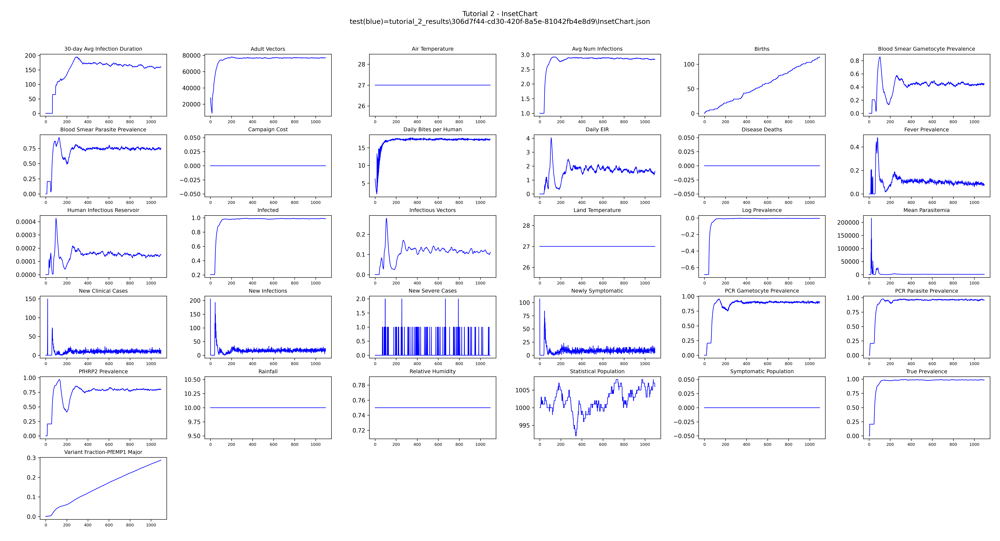
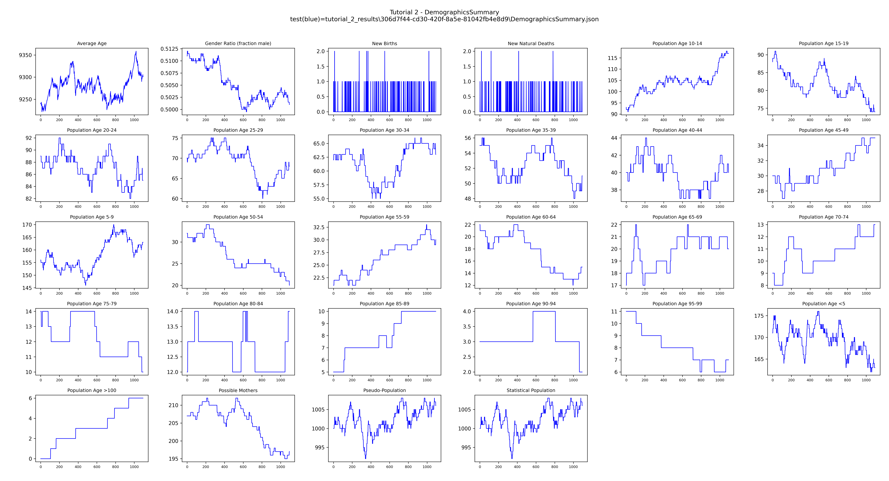

# Tutorial 2: Reports

This tutorial builds on Tutorial 1 by adding output reports, downloading the results, and
plotting the data. It introduces `add_reporters()`, idmtools analyzers, and the emodpy-malaria
plotting utilities.

**File:** `tutorials/tutorial_2_reports.py`

## Adding reports

A new `add_reporters()` function configures the reports to add to the simulation task. Reports
are added after `EMODTask` is created and before the experiment runs.

```python
def add_reporters(task):
    task.config.parameters.Enable_Default_Reporting = 1
    task.config.parameters.Enable_Demographics_Reporting = 1

    add_malaria_summary_report(task, manifest,
                               start_day=1,
                               end_day=sim_years * 365,
                               reporting_interval=30,
                               age_bins=[0.25, 5, 115],
                               max_number_reports=sim_years * 13,
                               filename_suffix="monthly",
                               pretty_format=True)
```

Three reports are enabled:

- **InsetChart** (`Enable_Default_Reporting = 1`) — EMOD's built-in time-series summary.
  Channels include fraction infected, daily EIR, new clinical cases, and many others.
- **DemographicsSummary** (`Enable_Demographics_Reporting = 1`) — population and vital dynamics
  over time. `set_team_defaults()` disables this by default, so it is re-enabled here.
- **MalariaSummaryReport** — age-stratified malaria metrics (PfPR, clinical incidence,
  population) grouped by reporting interval and age bin. The `filename_suffix` produces
  `MalariaSummaryReport_monthly.json`.

`add_reporters()` is called after `EMODTask` is created in `run_experiment()`:

```python
task = emod_task.EMODTask.from_default2(...)
add_reporters(task)
```

## Downloading results

After the experiment completes, `DownloadAnalyzer` copies specific output files from each
simulation into a local directory. This works the same way regardless of platform — Container,
COMPS, or SLURM.

```python
filenames = [
    "output/InsetChart.json",
    "output/DemographicsSummary.json",
    "output/MalariaSummaryReport_monthly.json",
]
analyzers = [DownloadAnalyzer(filenames=filenames, output_path=output_path)]

manager = AnalyzeManager(platform=platform, analyzers=analyzers)
manager.add_item(experiment)
manager.analyze()
```

The download only runs when `experiment.succeeded` is true. After it completes,
`tutorial_2_results/` contains one subdirectory per simulation, named by its unique ID:

```
tutorial_2_results/
  551dfe56-f2f8-4831-9f15-b7c0ac529557/
    InsetChart.json
    DemographicsSummary.json
    MalariaSummaryReport_monthly.json
```

## Plotting results

`plot_inset_chart()` reads all `InsetChart.json` files found under `output_path` and overlays
them on the same axes — one line per simulation — giving a quick overview of every channel over
time.

```python
plot_inset_chart(dir_name=output_path,
                 title="Tutorial 2 - InsetChart",
                 output=output_path)
```

`DemographicsSummary.json` has the same channel report format as `InsetChart.json` and can be
plotted the same way. `get_filenames()` locates the downloaded files by prefix:

```python
demog_files = get_filenames(dir_or_filename=output_path,
                            file_prefix="DemographicsSummary",
                            file_extension="json")
if demog_files:
    plot_inset_chart(comparison1=demog_files[0],
                     title="Tutorial 2 - DemographicsSummary",
                     output=output_path)
```

The resulting images are saved to `tutorial_2_results/`.

## Example output





## Next

[Tutorial 3](tutorial-3.md) adds a campaign file with treatment-seeking care and ITNs, and
compares scenarios with and without interventions.
