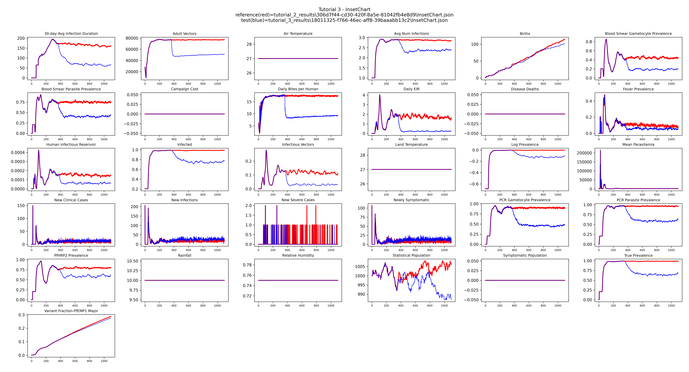
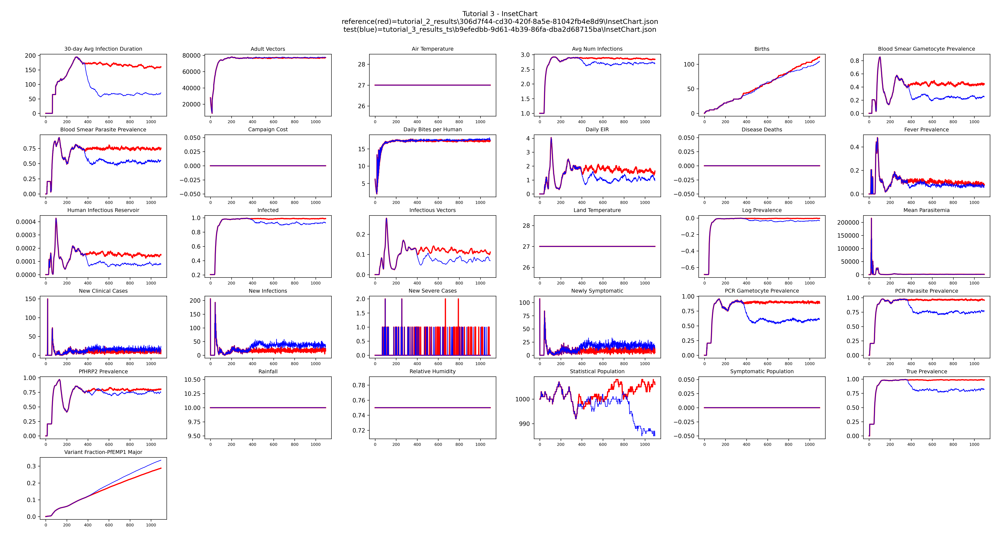
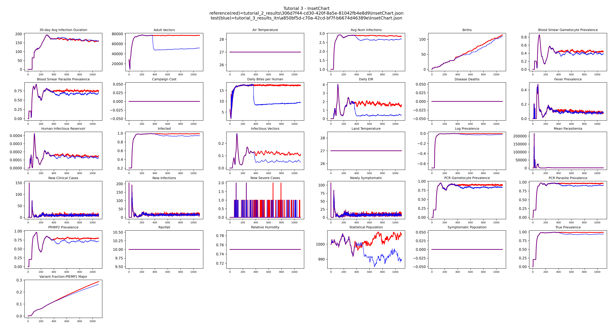
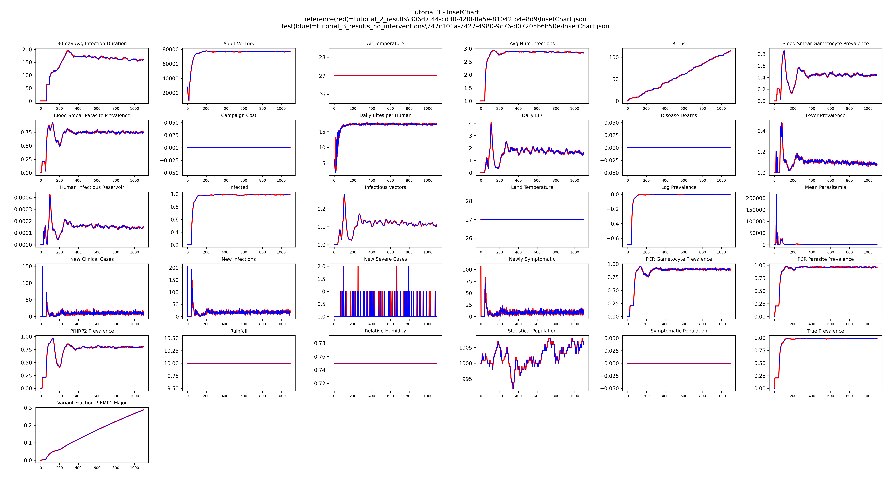

# Tutorial 3: Interventions

This tutorial adds two interventions that represent a standard malaria control package:
treatment-seeking care and insecticide-treated nets (ITNs). It introduces the campaign file
and shows how to compare scenarios with and without interventions.

**File:** `tutorials/tutorial_3_interventions.py`

## The campaign file

The campaign file defines what interventions to distribute, to whom, and when. In emodpy-malaria
a `build_campaign()` function constructs this file and is passed to `EMODTask` via
`campaign_builder=`:

```python
task = emod_task.EMODTask.from_default2(
    ...
    campaign_builder=build_campaign,   # previously None
    ...
)
```

## Interventions

`build_campaign()` adds the two interventions using emodpy-malaria helper functions:

```python
def build_campaign():
    campaign.set_schema(manifest.schema_file)

    if use_treatment_seeking:
        add_treatment_seeking(campaign,
                              start_day=365,
                              targets=[{"trigger": "NewClinicalCase", "coverage": 0.7},
                                       {"trigger": "NewSevereCase",   "coverage": 0.9}])

    if use_itn:
        add_itn_scheduled(campaign,
                          start_day=365,
                          demographic_coverage=0.5,
                          receiving_itn_broadcast_event="Received_ITN")

    return campaign
```

**Treatment seeking** covers people who develop new clinical cases (70% coverage) and severe
cases (90% coverage). The drug defaults to artemether-lumefantrine, the standard first-line
therapy. Both interventions start on day 365, giving the population one year to reach a
baseline before any control begins.

**ITN distribution** distributes insecticide-treated nets to 50% of the population on day 365.
`receiving_itn_broadcast_event` causes EMOD to fire a `Received_ITN` event for each person
who receives a net, which can be used to trigger follow-up events in more complex campaigns.

## Comparing scenarios

Two boolean flags at the top of the script control which interventions are active:

```python
use_treatment_seeking = True
use_itn = True
```

Toggle these and re-run to compare each intervention separately against the no-intervention
baseline. Each combination writes to its own output directory:

| `use_treatment_seeking` | `use_itn` | Output directory |
|---|---|---|
| True | True | `tutorial_3_results` |
| True | False | `tutorial_3_results_ts` |
| False | True | `tutorial_3_results_itn` |
| False | False | `tutorial_3_results_no_interventions` |

## Plotting with a baseline reference

`plot_results()` looks for `tutorial_2_results/` from the previous tutorial and, if found,
uses it as the no-intervention reference (plotted in red) so the intervention impact is
visible directly. If you are starting here without having run Tutorial 2, the plot will still
work — the reference line simply will not appear.

```python
reference = None
if os.path.exists("tutorial_2_results"):
    t2_files = get_filenames(dir_or_filename="tutorial_2_results",
                             file_prefix="InsetChart", file_extension="json")
    if t2_files:
        reference = t2_files[0]

plot_inset_chart(dir_name=output_path,
                 reference=reference,
                 title="Tutorial 3 - InsetChart",
                 output=output_path)
```

Treatment seeking reduces the fraction of people infected; ITNs reduce the daily biting rate
and vector population. Running each combination separately lets you see each effect in
isolation.

## Example output

**Both interventions** (`use_treatment_seeking = True`, `use_itn = True`)



**Treatment seeking only** (`use_treatment_seeking = True`, `use_itn = False`)



**ITN only** (`use_treatment_seeking = False`, `use_itn = True`)



**No interventions** (`use_treatment_seeking = False`, `use_itn = False`)



## Next

[Tutorial 4](tutorial-4.md) introduces seasonal transmission by replacing the constant larval
habitat with a LINEAR_SPLINE.
