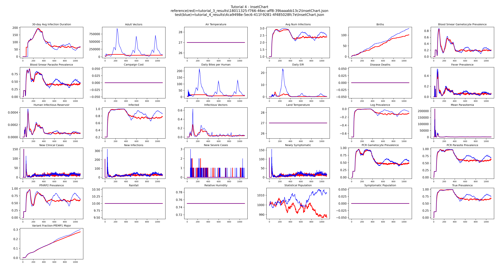

# Tutorial 4: Seasonality

Real malaria transmission is seasonal: mosquito populations rise and fall with rainfall,
creating peaks during the wet season and troughs during the dry season. This tutorial replaces
the team default habitat from previous tutorials with a `LINEAR_SPLINE` habitat that
captures a realistic seasonal pattern.

**File:** `tutorials/tutorial_4_seasonality.py`

## Why LINEAR_SPLINE

EMOD supports weather-file-driven habitat, but `LINEAR_SPLINE` is easier to work with: you
define the seasonal shape directly as a scaling curve rather than sourcing and formatting
external climate data. This makes it straightforward to control and tune the seasonal pattern
for your site.

## Configuring the seasonal habitat

`configure_linear_spline()` builds a habitat object from a set of (day, scale) pairs. The
scale values are relative multipliers on `max_larval_capacity` — values near zero represent
the dry season, the peak represents the wet season.

```python
seasonal_habitat = vector_config.configure_linear_spline(
    manifest,
    max_larval_capacity=1e8,
    capacity_distribution_number_of_years=1,
    capacity_distribution_over_time={
        "Times":  [0,   30,  60,   91,  122, 152, 182, 213,  243, 274, 304, 334, 365],
        "Values": [3.0, 0.8, 1.25, 0.1, 2.7, 8.0, 4.0, 25.0, 6.8, 6.5, 2.6, 2.1, 3.0]
    }
)
```

This curve has a pronounced wet-season peak around day 213 (early August) and a dry-season
trough around day 91 (April), representing a site in East Africa with a long rains season.
`capacity_distribution_number_of_years=1` tells EMOD to repeat the same curve every year.

The habitat object is then applied to each vector species, replacing the `TEMPORARY_RAINFALL`
habitat set by `set_team_defaults()`:

```python
for species in ["gambiae", "arabiensis", "funestus"]:
    malaria_config.set_species_param(config, species, "Habitats",
                                     seasonal_habitat, overwrite=True)
```

`overwrite=True` replaces the existing habitat rather than adding a second one alongside it.

## Simulation duration

`sim_years` is kept at 3 so the repeating seasonal pattern in the vector population is clearly
visible in the output before and after interventions begin on day 365.

## Plotting with a baseline reference

`plot_results()` looks for `tutorial_3_results/` from the previous tutorial and, if found,
uses it as the constant-transmission reference (plotted in red) so the seasonal signal stands
out directly against the flat baseline. If you are starting here without having run Tutorial
3, the plot will still work — the reference line simply will not appear.

```python
plot_inset_chart(dir_name=output_path,
                 reference=reference,
                 title="Tutorial 4 - InsetChart",
                 output=output_path)
```

The flat lines from Tutorial 3 become wave-shaped seasonal cycles, with transmission rising
and falling each year in step with the habitat scaling curve.

## Example output



## Next

[Tutorial 5](tutorial-5.md) introduces parameter sweeps with `SimulationBuilder`, running
multiple simulations across a range of treatment-seeking coverage values.
