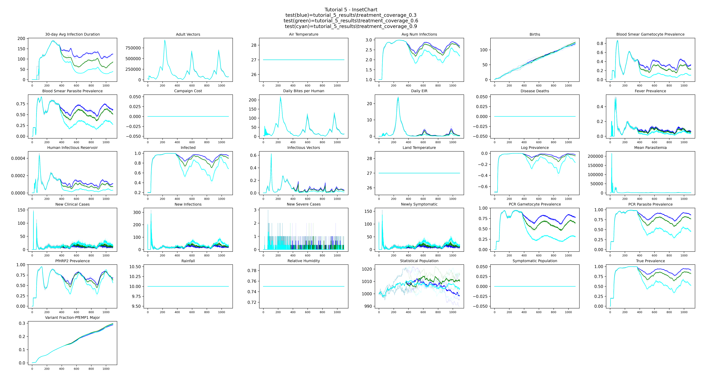

# Tutorial 5: Parameter sweeps

A parameter sweep runs the same scenario across a range of input values so you can study how
outcomes change with each parameter. This tutorial sweeps over treatment-seeking coverage to
show how different levels of case management affect malaria burden in a seasonal setting.

**File:** `tutorials/tutorial_5_sweep.py`

## SimulationBuilder

`SimulationBuilder` creates multiple simulations by combining sweep definitions. Each sweep
definition is a callback function paired with a list of values — the builder calls the
function once per value per simulation.

Adding two sweep definitions produces a cross-product: every combination of `treatment_coverage` and
`Run_Number` gets its own simulation. With 3 coverage values and 3 random seeds that is 9
simulations total:

```python
builder = SimulationBuilder()
builder.add_sweep_definition(update_campaign, [0.3, 0.6, 0.9])
builder.add_sweep_definition(sweep_run_number, [0, 1, 2])
```

## Sweeping campaign parameters

Coverage is now a parameter rather than a constant. `update_campaign()` is the sweep callback
that rebuilds the campaign for each simulation with the assigned coverage value:

```python
def update_campaign(simulation, treatment_coverage):
    build_campaign_partial = partial(build_campaign, treatment_coverage=treatment_coverage)
    simulation.task.create_campaign_from_callback(build_campaign_partial)
    return {"treatment_coverage": treatment_coverage}
```

`partial()` binds `treatment_coverage` to `build_campaign` so the resulting function takes no arguments,
which is what `create_campaign_from_callback()` expects. The dict returned becomes a tag on
the simulation — used below to group results by coverage value.

`build_campaign()` accepts `treatment_coverage` as a parameter and applies it to both clinical and severe
case targets:

```python
def build_campaign(treatment_coverage=0.8):
    add_treatment_seeking(campaign,
                          start_day=365,
                          targets=[{"trigger": "NewClinicalCase", "coverage": treatment_coverage},
                                   {"trigger": "NewSevereCase",
                                    "coverage": min(treatment_coverage + 0.2, 1.0)}])
```

ITN coverage remains fixed at 0.5 — only treatment-seeking coverage is swept.

## Grouping results by coverage

After downloading, `group_by_coverage()` reads the `treatment_coverage` tag from each simulation in
the experiment object and moves its downloaded directory into a subdirectory named by coverage
value:

```python
def group_by_coverage(experiment, output_path):
    for sim in experiment.simulations:
        coverage = sim.tags.get("treatment_coverage")
        sim_dir = os.path.join(output_path, str(sim.id))
        label = f"treatment_coverage_{coverage}"
        target_dir = os.path.join(output_path, label)
        os.makedirs(target_dir, exist_ok=True)
        shutil.move(sim_dir, os.path.join(target_dir, str(sim.id)))
```

Reading tags from the experiment object works on all platforms — Container, COMPS, and SLURM.

After grouping, `tutorial_5_results/` contains one subdirectory per coverage value:

```
tutorial_5_results/
  treatment_coverage_0.3/
    {sim_id}/InsetChart.json   ← Run_Number 0
    {sim_id}/InsetChart.json   ← Run_Number 1
    {sim_id}/InsetChart.json   ← Run_Number 2
  treatment_coverage_0.6/
    ...
  treatment_coverage_0.9/
    ...
```

## Plotting by coverage group

`plot_mean()` takes one directory per coverage group and uses the directory name as the legend
label. `show_raw_data=True` overlays the individual simulation lines in a lighter color so
the stochastic spread within each group is visible alongside the mean:

```python
from emodpy_malaria.plotting.plot_inset_chart_mean_compare import plot_mean

plot_mean(dir1=dirs[0],
          dir2=dirs[1],
          dir3=dirs[2],
          title="Tutorial 5 - InsetChart",
          show_raw_data=True,
          output=output_path)
```

## Example output

The plot shows one bold mean line per coverage group (`treatment_coverage_0.3`, `treatment_coverage_0.6`, `treatment_coverage_0.9`), with the
three individual stochastic runs shown in a lighter color behind each mean. With higher
coverage, there are fewer infected people (Infected channel) and each infection resolves more
quickly (30-day Avg Infection Duration). Together, fewer infected people spending less time
infected means mosquitoes have less opportunity to acquire infection from humans — resulting
in fewer infectious vectors and a lower Daily EIR.



## Next

[Tutorial 6](tutorial-6.md) introduces calibration with `CalibManager`, fitting
`x_Temporary_Larval_Habitat` to match a reference PfPR target.
