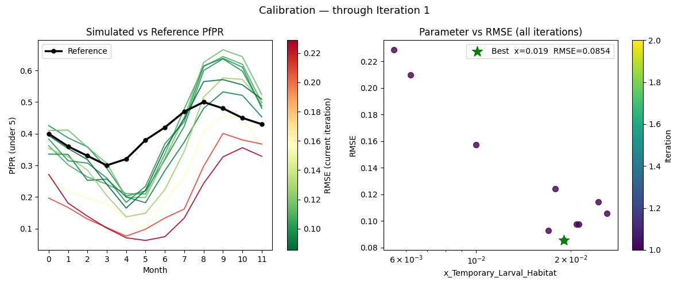
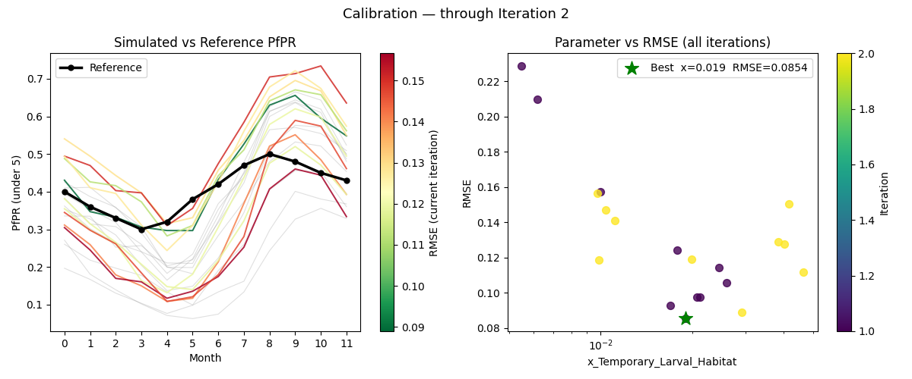
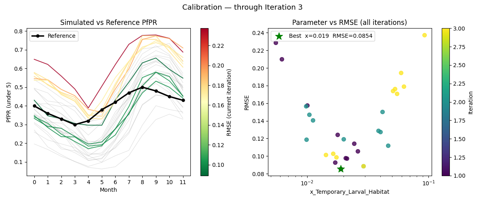
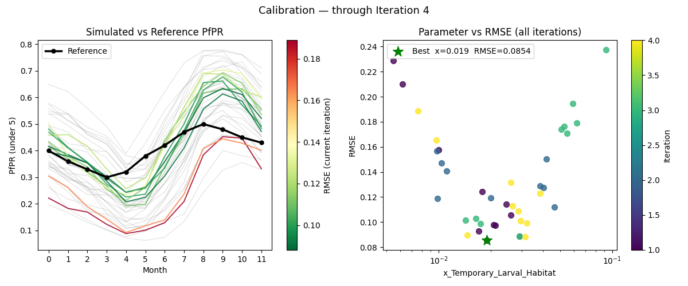
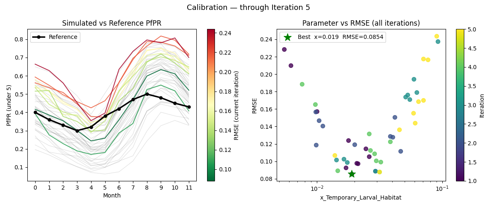
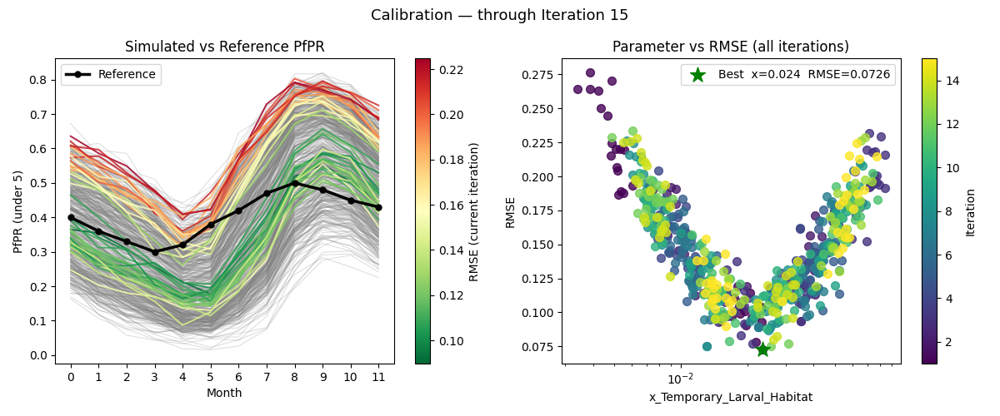

# Tutorial 6: Calibration

Calibration adjusts a model parameter until simulation output matches observed reference data.
This tutorial calibrates `x_Temporary_Larval_Habitat` — a scale factor that multiplies larval
habitat capacity for all habitat types — to match a reference monthly PfPR curve for
children under 5 (`tutorial_6_reference_pfpr.csv`).

Interventions are removed for this tutorial so that simulated PfPR reflects baseline
transmission only. Tutorial 7 adds interventions back once the right transmission intensity is
established.

**File:** `tutorials/tutorial_6_calibration.py`

## Calibration framework

This tutorial uses `idmtools-calibra`, which provides four key components:

| Component | Role |
|-----------|------|
| `CalibManager` | Orchestrates the calibration loop — runs iterations, collects scores, writes results |
| `OptimTool` | Gradient-free optimizer: proposes parameter samples each iteration and moves toward better values based on scores |
| `CalibSite` | Bundles reference data and analyzers for one calibration target |
| `BaseCalibrationAnalyzer` | Map/reduce framework for scoring simulations against reference data |

`CalibManager` replaces `SimulationBuilder` and `Experiment` from previous tutorials — it
creates and runs experiments internally.

## Searching in log space

`x_Temporary_Larval_Habitat` spans several orders of magnitude (0.0001 to 0.1). Searching
this range in linear space is inefficient because OptimTool's step size is a fixed fraction
of the linear range — steps near 0.1 are proportionally tiny while the same step near 0.0001
overshoots the entire lower region.

The solution is to calibrate in **log10 space** by defining the parameter as
`log10_x_Temporary_Larval_Habitat` with bounds [-4, -1]:

```python
CALIBRATION_PARAMETERS = [
    {
        "Name":    "log10_x_Temporary_Larval_Habitat",
        "Dynamic": True,
        "Guess":   -2.0,   # 10^-2 = 0.01
        "Min":     -4.0,   # 10^-4 = 0.0001
        "Max":     -1.0,   # 10^-1 = 0.1
    }
]
```

OptimTool sees a parameter between -4 and -1 and searches it like any other linear range.
Each step of 0.3 log units is a factor of 2× — a consistent proportional step regardless of
where in the range the search is. That proportional consistency is why log space explores a
parameter spanning orders of magnitude more evenly.

`map_sample_to_model_input()` converts back to linear space before applying the value to each
simulation:

```python
def map_sample_to_model_input(simulation, sample):
    log_value = float(sample["log10_x_Temporary_Larval_Habitat"])
    value = 10 ** log_value
    simulation.task.config.parameters.x_Temporary_Larval_Habitat = value
    return {"x_Temporary_Larval_Habitat": value}
```

The linear value is stored as a simulation tag so the analyzer can read it back for plotting.

## How OptimTool works

OptimTool is not a random sampler. Each iteration it:

1. Fits a linear regression through the previous iteration's samples and scores
2. If R² is above the threshold, takes a gradient ascent step — moves the search center in
   the direction that improves the score
3. If R² is below the threshold, jumps to the best-scoring sample
4. Draws new samples on a hypersphere around the new center

The search center moves toward the optimum each iteration while the sampling radius stays
fixed. You can watch this in the right panel of the plots below — the samples cluster
progressively closer to the best value across iterations.

## The analyzer: map and reduce

`MalariaSummaryAnalyzer` subclasses `BaseCalibrationAnalyzer` and implements two methods:

**`map(data, item)`** — called once per simulation. Extracts the last 12 monthly PfPR values
(under-5 age group) from `MalariaSummaryReport_monthly.json`. The last 12 time steps are the
final year of the 5-year simulation, after the population has reached a stable seasonal
pattern. Age bin index 1 is the 0.25–5 year age group, matching the reference data.

**`reduce(all_data)`** — called once per iteration with results from all simulations. Computes
RMSE (Root Mean Square Error) against the reference PfPR, saves a per-iteration CSV, updates
the cumulative plot, and returns scores. Calibra **maximizes** the score, so `reduce()` returns
`1/RMSE` — a closer match produces a higher score.

## Reading the plots

After each iteration a two-panel plot is saved to `tutorial_6_calibration/plots/`:

- **Left panel** — simulated PfPR curves vs the reference (black line). Past iterations are
  shown in grey; the current iteration is colored green-to-red by RMSE so fit quality is
  visible at a glance.
- **Right panel** — `x_Temporary_Larval_Habitat` vs RMSE for all iterations, colored by
  iteration number (dark = early, bright = late). The green star marks the best sample across
  all iterations.

There is no automated stopping criterion — stop when the fit looks close enough.

## Experimenting with the settings

Once the calibration runs, try adjusting these constants and re-running to see how they
change the plots.

**`N_SAMPLES`** controls how many simulations run per iteration. More samples give OptimTool
more data to fit its linear regression, which means a more accurate gradient estimate and a
better-directed step to the next center. In the right panel you will see more dots per
iteration color. Fewer samples produce a noisier fit — the center may step in the wrong
direction, and you will see more scatter in the right panel. For a single parameter like this
one, 10 samples is usually sufficient. For calibrations with more parameters, a rough guide
is at least 10 samples per parameter.

**`N_ITERATIONS`** controls how many times OptimTool moves the center and resamples. More
iterations allow more steps toward the optimum — in the right panel the dots should cluster
progressively closer to the green star as iterations increase, and the grey cloud in the left
panel should thicken while the current iteration's curves get closer to the reference. For
this single-parameter calibration, convergence is usually visible within 3–5 iterations. More
complex calibrations with several parameters need more.

**`CALIBRATION_PARAMETERS`** — specifically `Guess`, `Min`, and `Max`:

- **`Guess`** is where OptimTool centers its first hypersphere. A good guess means iteration 1
  already explores the right region; a poor guess means the first iteration's PfPR curves in
  the left panel will all be too high or too low relative to the reference. Try changing
  `Guess` from `-2.0` to `-3.5` or `-1.5` and watch how iteration 1 looks different.

- **`Min` and `Max`** define the search bounds in log10 space. The green star in the right
  panel can never fall outside these bounds. If the bounds are too narrow and exclude the true
  value, the calibration will converge to the boundary. If they are too wide, more iterations
  are needed to explore the space. The current bounds `[-4, -1]` correspond to
  `[0.0001, 0.1]` in linear space — a range that covers several orders of magnitude and is
  wide enough for most single-site malaria calibrations.

## Using the calibrated value in Tutorial 7

When calibration finishes the script prints the best-fit log10 value to the terminal:

```
============================================================
NEXT STEP: open tutorial_6_calibration/CalibManager.json, find
  final_samples -> log10_x_Temporary_Larval_Habitat[0]
  and paste that value into CALIBRATED_LOG10_X_LARVAL_HABITAT
  in tutorial_7_burnin.py and tutorial_7_pickup.py
============================================================
```

Open `tutorial_6_calibration/CalibManager.json` and look for:

```json
"final_samples": {
    "log10_x_Temporary_Larval_Habitat": [
        -1.5025470616699972
    ]
},
```

!!! note "If `final_samples` is not in CalibManager.json"
    This key is only written when all iterations complete. If calibration was stopped early,
    look at the right panel of the iteration plots — the green star marks the best sample
    across all completed iterations. Use that `x_Temporary_Larval_Habitat` value, converting
    it to log10 space (`log10(value)`), or pick the best row from any
    `tutorial_6_calibration/iter*/pfpr_records.csv` by choosing the row with the lowest RMSE.

Paste the value into **both** `tutorial_7_burnin.py` and `tutorial_7_pickup.py` —
`CALIBRATED_LOG10_X_LARVAL_HABITAT` must be the same in both scripts:

```python
# ================================================================
# UPDATE - Paste the log10 value from Tutorial 6.
# ================================================================
CALIBRATED_LOG10_X_LARVAL_HABITAT = -1.61  # replace with your value
```

Both scripts convert the log10 value to linear space automatically (`10 ** value`) —
you do not need to do the conversion yourself.

## Calibration progress

**Iteration 1**



**Iteration 2**



**Iteration 3**



**Iteration 4**



**Iteration 5**



**Iteration 15**



With N_SAMPLES=40 and N_ITERATIONS=15, the curves in the left panel have
converged tightly around the reference line, and the right panel shows the
parameter-vs-RMSE scatter clustered near the green star. Compare this to
iteration 1, where the curves were spread across a wide range. More samples
and iterations allow OptimTool to take more confident steps and narrow in
on the best value.

## Next

[Tutorial 7](tutorial-7.md) uses the calibrated value to run a burnin to equilibrium, then
starts intervention scenarios from the serialized population.
