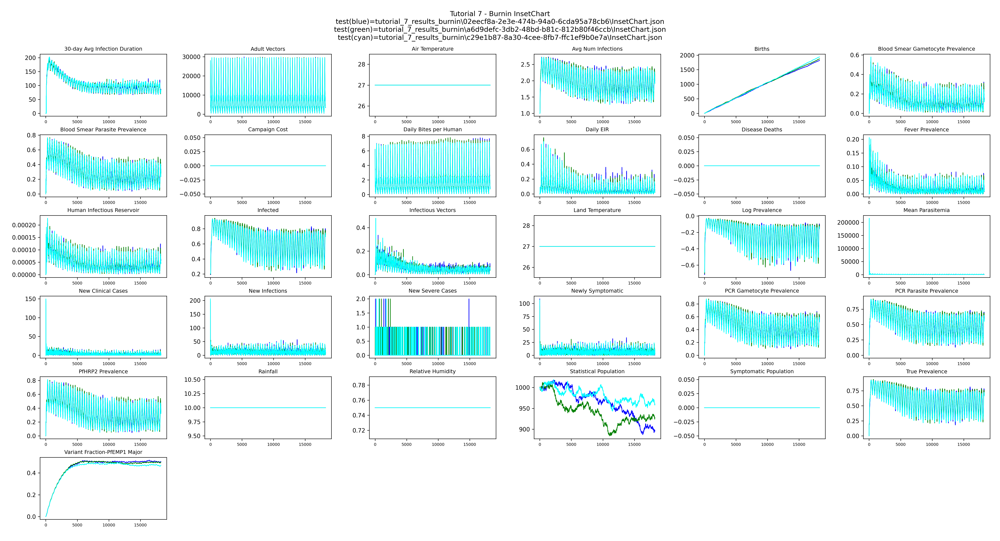
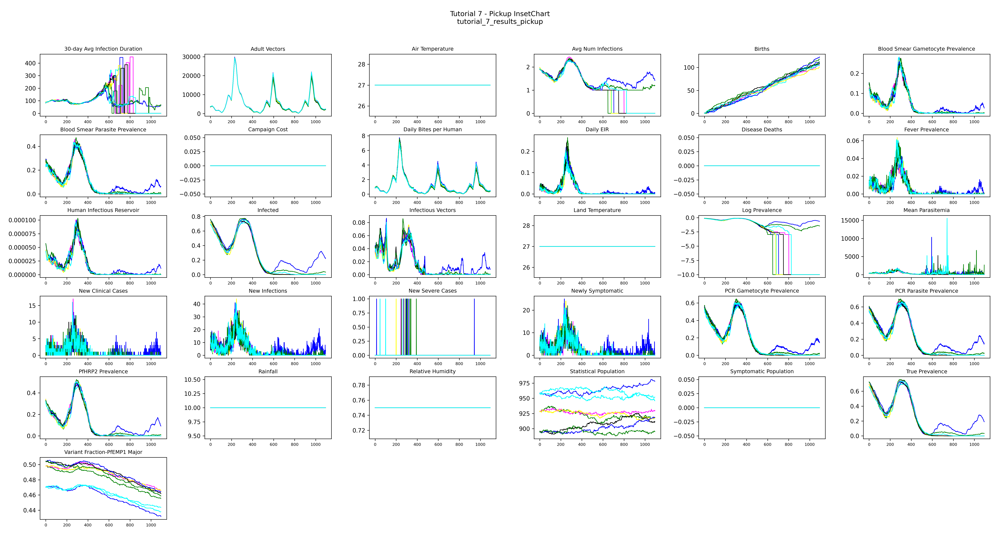
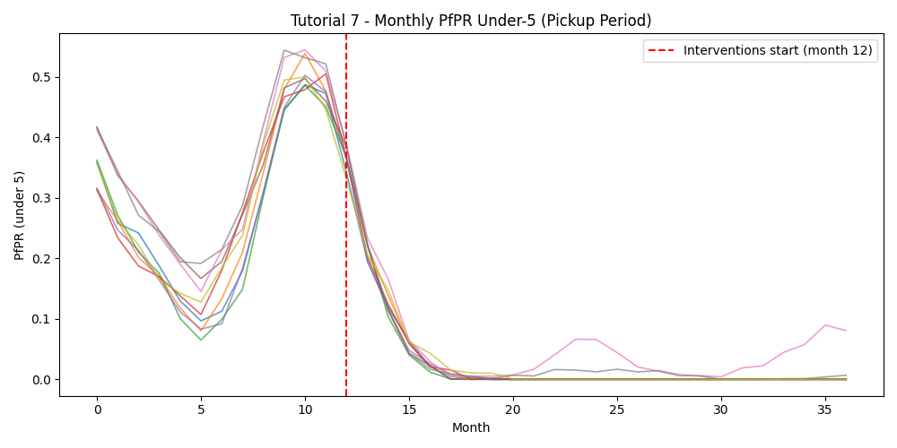

# Tutorial 7: Serialization

Developing a population with realistic individual immunities takes time. In EMOD, every
individual starts with no immunity and builds it up one infection at a time — each person's
immune state reflects their lifetime history of infections, which the model tracks at the
individual level. As a result, even when a simulation begins with realistic demographics, a
newly-created 40-year-old has the same immunity profile as a newborn because they haven't yet
had the infections they would have experienced in real life. It typically takes 50–80 simulated
years for the population to develop naturally acquired immunity patterns. This 50–80 year
warm-up period is called a burnin.

A burnin also establishes realistic age structure, infection history, and vector dynamics —
all of which takes 50–80 simulated years to develop. Running that burnin before every 5–10
year intervention scenario — and then multiplying that across sweeps over run numbers and
efficacies — adds substantial compute and turnaround overhead. The solution is [serialization](../emod/software-serializing-pops.md):
run the burnin once, save the full population state to disk, and start every subsequent
intervention scenario from that saved state rather than from scratch.

!!! note "Modeling a real site"
    For a study at a real location you would include that site's historical interventions in
    the burnin so the population's immunity reflects what people there have actually
    experienced. Interventions affect natural immunity — for example, a population with highly
    effective bed nets over many years will have less naturally acquired immunity than one
    without nets, because they have had fewer infections. The burnin in this tutorial uses no
    interventions to keep things simple.

Tutorial 7 is split into two scripts:

| Script | Purpose |
|--------|---------|
| `tutorial_7_burnin.py` | Simulate 50 years with no interventions and serialize the population — requires `CALIBRATED_LOG10_X_LARVAL_HABITAT` from [Tutorial 6](tutorial-6.md#using-the-calibrated-value-in-tutorial-7) |
| `tutorial_7_pickup.py` | Load the serialized states and run intervention scenarios from them |

## Part 1: Burnin

**File:** `tutorials/tutorial_7_burnin.py`

### Serialization parameters

Three parameters in `build_config()` tell EMOD to write a population snapshot at the end of
the simulation:

```python
config.parameters.Serialized_Population_Writing_Type = "TIME"
config.parameters.Serialization_Times                = [serialize_years * 365]
config.parameters.Serialization_Precision            = "REDUCED"
```

`Serialized_Population_Writing_Type = "TIME"` tells EMOD to write a population snapshot at
the simulation days listed in `Serialization_Times`.

`Serialization_Times` is a list of days at which to write snapshots — here, the last
day of the 50-year run. EMOD writes the population to a `.dtk` file named `state-NNNNN.dtk`
where `NNNNN` is the timestep zero-padded to five digits (e.g. `state-18250.dtk` for day
18250).

`Serialization_Precision` controls how much detail is saved. `REDUCED` gives smaller files
but with some loss of numerical precision. Full precision allows byte-wise exact
reproducibility: a simulation run continuously from day 0 to 1000 will produce output
identical to one that runs to day 500, serializes, then picks up and runs to day 1000 —
aside from very small floating-point rounding differences. `REDUCED` still gives very similar
results but will not reproduce the continuous run exactly. For most intervention studies this
is acceptable; choose full precision if exact reproducibility matters for your analysis.

### Stochastic runs

The burnin runs `N_BURNIN_RUNS` simulations with different random seeds, producing
independent population states that each have a different immune history:

```python
builder.add_sweep_definition(sweep_run_number, range(N_BURNIN_RUNS))
```

### Getting the experiment ID

When the burnin finishes, the experiment ID is printed to the terminal.
Copy this experiment ID into tutorial_7_pickup.py before running Part 2:

```
# ================================================================
# UPDATE - Paste the experiment ID printed by tutorial_7_burnin.py
# ================================================================
BURNIN_EXP_ID = "paste-your-burnin-experiment-id-here"
```

## Part 2: Pickup

**File:** `tutorials/tutorial_7_pickup.py`

### Reading from a serialized population

To pick up from a burnin, three config parameters tell EMOD where to find the `.dtk` file
and to read it rather than initialize from scratch:

```python
config.parameters.Serialized_Population_Reading_Type  = "READ"
config.parameters.Serialized_Population_Path          = "<path to burnin output>"
config.parameters.Serialized_Population_Filenames     = ["state-18250.dtk"]
```

In a single pickup these would be set directly in `build_config()`. Because this tutorial
sweeps over multiple burnin runs, they are set per-simulation in
`update_serialize_parameters()` — covered below.

### The sweep: immune history × stochastic variation

The pickup runs a cross-product of two sweep dimensions:

```python
builder.add_sweep_definition(
    partial(update_serialize_parameters, df=burnin_df),
    range(n_burnin)
)
builder.add_sweep_definition(sweep_run_number, range(N_SIMS_PER_PICKUP))
```

The first dimension links each pickup simulation to a burnin run, capturing variation
in immune history. The second adds independent stochastic variation on top of each starting
state. With `N_BURNIN_RUNS=3` and `N_SIMS_PER_PICKUP=3` this produces 9 pickup simulations.

To also sweep an intervention parameter such as treatment-seeking coverage, add a third sweep
definition following the same pattern as Tutorial 5.

### Locating the burnin output

`get_burnin_df()` loads the burnin experiment by ID, retrieves each simulation's output
directory, and returns a DataFrame sorted by `Run_Number` — one row per burnin simulation.
Path resolution differs by platform:

```python
if platform_type == "COMPS":
    path = sim.get_platform_object().hpc_jobs[0].working_directory
    path = path.replace("\\", "/").replace("internal.idm.ctr", "mnt").replace("IDM2", "idm2")
    outpath = path + "/output"
elif hasattr(platform, 'data_mount'):
    # Container: EMOD runs inside Docker, convert host path to container path
    from idmtools_platform_container.utils.general import map_container_path
    host_path = str(sim.get_directory())
    container_path = map_container_path(platform.job_directory, platform.data_mount, host_path)
    outpath = container_path + "/output"
else:
    outpath = os.path.join(str(sim.get_directory()), "output")
```

When EMOD runs on the Container platform, it executes inside a Docker container — a small,
isolated environment with its own filesystem that doesn't share paths with the host machine.
To let EMOD read and write to a real location on disk, a host directory is mounted into the
container: Docker wires up a host path (`platform.job_directory`) and a container path
(`platform.data_mount`) so they point to the same files. The host calls the folder one thing;
the container calls it another; both are the same files underneath.

This creates a translation problem in the code above. `sim.get_directory()` returns the host
path — the location as your machine sees it (e.g. `C:\Users\my_work\jobs\sim_abc`). But EMOD,
running inside the container, has no idea what that path means; from its perspective the same
folder lives somewhere like `/home/container_user/jobs/sim_abc`. If we hand the host path to
EMOD, it will fail to find the directory.

`map_container_path(job_directory, data_mount, host_path)` does the translation. It strips
off the host-side mount prefix (`job_directory`) and replaces it with the container-side mount
prefix (`data_mount`), producing the same physical location expressed in the container's path
language. That's the path EMOD can actually use to find its output.

The other two branches don't need this: COMPS does its own host-to-network-share rewrite, and
the local fallback already runs in the same filesystem EMOD sees, so `sim.get_directory()`
works as-is.

### Linking each pickup to a burnin run

`update_serialize_parameters()` sets `Serialized_Population_Path` and
`Serialized_Population_Filenames` for each pickup simulation based on its row index into
`burnin_df`:

```python
def update_serialize_parameters(simulation, x, df):
    sim_path = df["outpath"][x]
    filename = f"state-{serialize_years * 365:05d}.dtk"
    simulation.task.config.parameters.Serialized_Population_Path      = sim_path
    simulation.task.config.parameters.Serialized_Population_Filenames = [filename]
    return {
        "Run_Number":                 int(df["run_number"][x]),
        "Serialized_Population_Path": sim_path,
    }
```

### Interventions

`build_campaign()` adds treatment-seeking care and ITNs starting on day 365 of the pickup run —
the same interventions from Tutorial 3, giving the population one year to settle before
interventions begin. The pickup runs for `sim_years = 3` years.

### Output

Results are saved to `tutorial_7_results_burnin/` and `tutorial_7_results_pickup/`. The
pickup plot includes an InsetChart overlay of all runs and a monthly PfPR figure with
a vertical line marking when interventions start (month 12).

## Example output

**Burnin InsetChart** — overlay of the three 50-year burnins shows the stochastic differences
between three independent runs:



**Pickup InsetChart** — all pickup runs overlaid; the population begins with realistic
immunity and interventions start on day 365:



The population starts with realistic immunity already built up over 50 years and preserved in
the serialized file. Day 0 of this simulation is identical to what you'd see after running a
50-year burnin from scratch. Interventions that begin on day 365 are effectively starting in
the 52nd simulated year — we just skip the cost of actually simulating the first 50.

**Pickup monthly PfPR** — under-5 PfPR across the pickup period; the red dashed line marks
when interventions begin:


