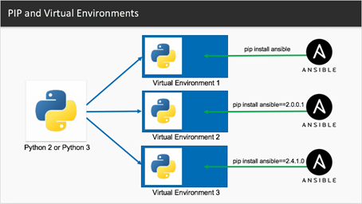

====================
Virtual environments
====================

Why use virtual environments
=============================

- A virtual environment is a self-contained folder with its own Python interpreter
  and libraries. It is already part of Python.
- Helps keep different projects isolated and organized.
- Avoids conflicts between project dependencies.
- Easily replicate environments across machines using ``requirements.txt`` or
  ``pyproject.toml`` files.
- Test and run different projects using different versions of the same package.
- Try out new packages or upgrades without affecting global Python.
- Keeps your system environment clean and uncluttered.

How to use virtual environments
================================

Create a virtual environment
-----------------------------

.. code-block:: console

   python -m venv myvenv

Activate a virtual environment
-------------------------------

**Windows**:

.. code-block:: doscon

   myenv\Scripts\activate.bat

**Mac/Linux**:

.. code-block:: bash

   source myenv/bin/activate

Now you're "inside" the environment.

Install packages into the virtual environment
---------------------------------------------

It is good practice to make sure pip is up to date first:

.. code-block:: console

   python -m pip install --upgrade pip

Now you can install packages into the environment, for example:

.. code-block:: console

   pip install emodpy-malaria

Deactivate a virtual environment
---------------------------------

When you are done or need to switch to a different project, use the following command
to exit the virtual environment:

.. code-block:: console

   deactivate
