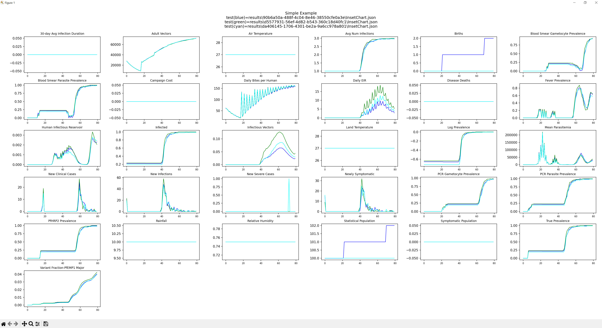
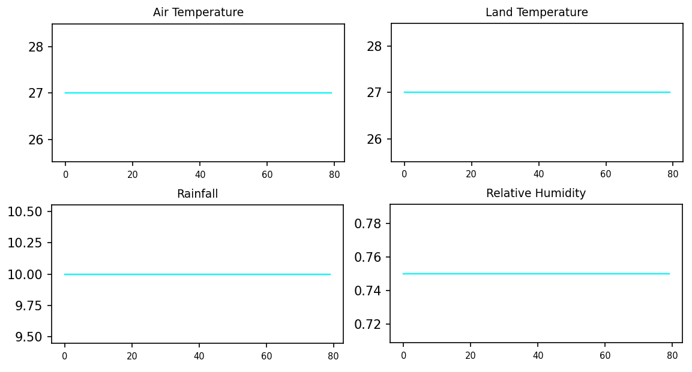
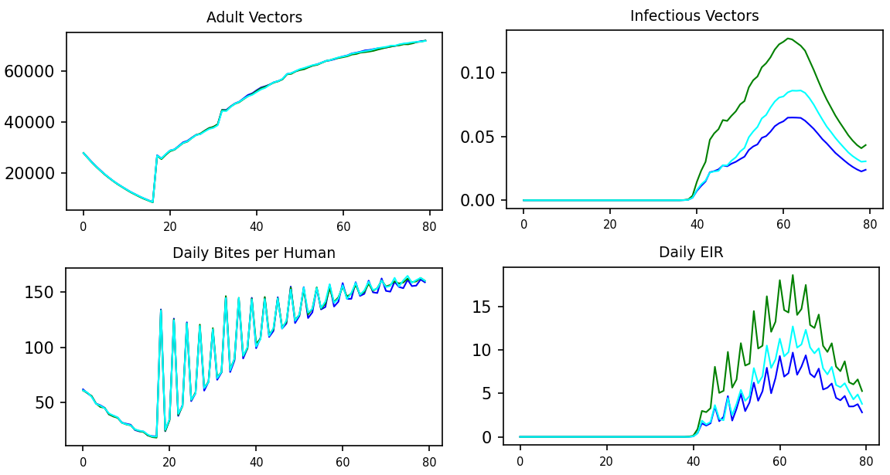
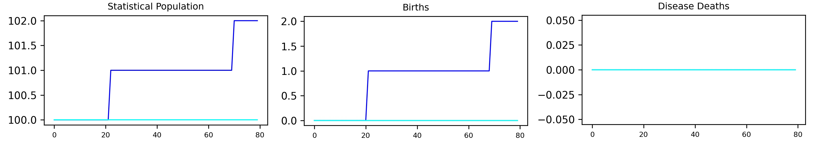
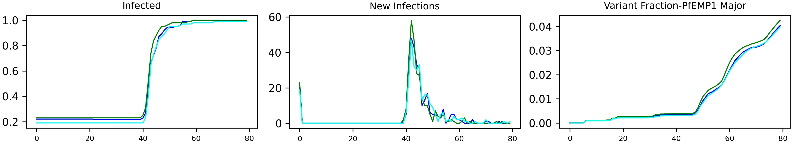
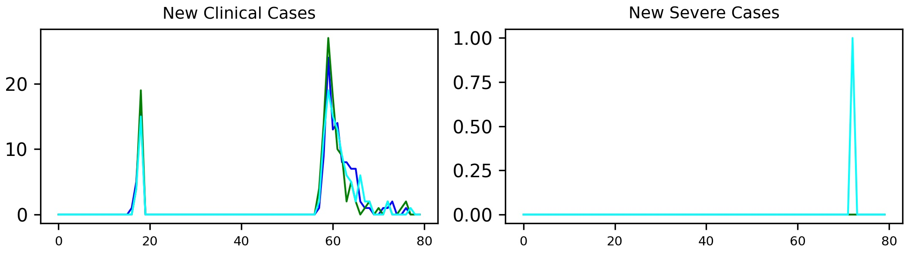
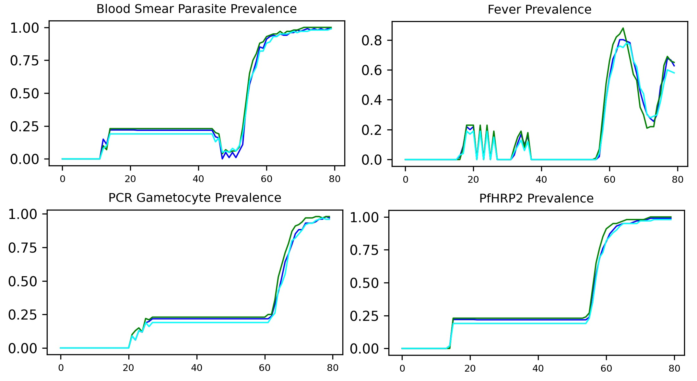

# Interpreting the results of Simple Example

At the end of the [Run Simple Example Tutorial](tutorial_run_simple_example.md), you generated
an image, results/Simple_Example.png.  This image shows 31 different time-based statistics
on the simulation.  The following will discuss many of these statistics so that you
can begin to get a feeling for the kinds of information you get get from EMOD about
your simulation.

## Prerequisites

This tutorial assumes you have run the examples-container/simple_example either on
Codespaces or locally.

## The InsetChart plot

EMOD's default report is called "InsetChart".  This report contains numerous statistics
over time.  The purpose of the report is to give you a quick overview of what is happening
in your simulation.  It is frequently helpful to see this data all at once because it allows
you to easily cross reference with other statistics.  For example, if you looked at the
**Infected** data and saw no one is infected, you might also look at the **Statistical Population**
data to verify there are people.  If there were no people, you could assume that is why
no one is infected.

NOTE:  Sometimes a statistic in InsetChart is referred to as a "channel".

Your Simple_Example.png should look something like the following:

## Weather information

InsetChart has four statistics on weather:
- Air Temperature
- Land Temperature
- Rainfall
- Relative Humidity

Below are these four statistics showing the value over time.  You will notice that these values
are constant over the 80 days of the simulation.  This is because the simulation was configured
to have constant weather.  This is a handy feature to use when you are trying to understand how
things work because you don't have to also adjust for how seasonality changes things.

## Mosquitoes / Vectors

InsetChart also has four statistics that are directly related to the mosquitoes or vectors that
are in the simulation.  These are:
- Adult Vectors
- Daily Human Biting Rate
- Daily EIR
- Infectious Vectors

These plots are much more interesting with **Adult Vectors** growing over time while **Infectious Vectors**
and **Daily EIR** don't get started until day 40.  Why do the plots have the shapes that they do?

EMOD is one of the only malaria models that includes the mosquitoes as its own set of agents.
EMOD models the mosquito through its life cycle from eggs to larve to adult and back again.
Please see [EMOD Vector Biology](https://docs.idmod.org/projects/emodpy-malaria/en/latest/emod/vector-model-overview.html)
for more information.

**Adult Vectors** - These are the adult female mosquitoes in the simulation. The scenario initializes with three species,
each starting with 10,000 individuals at day 0 (30,000 total). The simulation is initialized without
eggs or larva and, therefore, the adult population drops rapidly until day 18 because no new adults
are emerging yet - we're waiting for the eggs laid on the first day to complete their development
cycle and mature into adults. In longer simulations, the mosquito population would eventually
stabilize once the larval habitats reach carrying capacity

**Infectious Vectors** - This represents the proportion of **Adult Vectors** that are infectious to humans. These
mosquitoes have completed the full parasite development cycle:
- they fed on an infected human,
- acquired gametocytes,
- those gametocytes developed into oocysts, and
- the oocysts matured into sporozoites.

**Daily Bites per Human** - This metric demonstrates the relationship between vector
population dynamics and feeding behavior. It declines as the initial mosquito population
dies off, then surges on day 1 when the first generation of new adults emerges. The pattern
appears jagged initially because mosquitoes in this simulation feed every three days in
synchronized cycles. Over time, the pattern smooths out as feeding events become more evenly
distributed across days.

**Daily EIR** - This shows the daily count of infectious bites delivered to humans. The jagged pattern
mirrors **Daily Bites per Human** since infectious bites are a proportion of total bites.

To avoid some of these vector start up issues as well as establish immunity in the population,
users will do a simulation "burn-in".  This is where they will run the simulation for many
years to let the vectors and immunity to stabilize.  When that simulation finishes, they have
it create a "serialized population file".  This file is then used for new simulations.
please see [Serializing Populaitons](https://docs.idmod.org/projects/emodpy-malaria/en/latest/emod/software-serializing-pops.html) 
or more information.

## Demographic statistics

InsetChart includes three statistics on the demographics:
- Statistical Population
- Births
- Disease Deaths

**Statistical Population** - This tracks the total number of human agents in the
simulation at each time point.  The population fluctuates as new agents are born
and others die. In these results, you'll notice one of the simulations increase twice.
If we look at the **Births** statistic, we see those births for that simulation.

**Births** - This displays the cumulative count of births in the simulation. The
step-wise increases visible in certain simulation runs directly correspond to the
population growth seen in **Statistical Population**.

**Disease Deaths** - This data shows deaths attributed directly to malaria at each
time step. In these simulations, no disease deaths occur. Most users exclude malaria
mortality from their models due to insufficient calibration data, focusing instead
on infection dynamics and morbidity outcomes.

## Prevalence, incidence, and immunity

Simulation provides complete population visibility that's impossible in real-world
studies. The following statistics reveal infection patterns and immune responses
across the entire population:
- Infected
- New Infections
- Variant Fraction - PfEMP1 Major

**Infected** - This represents the fraction of the population currently harboring
parasites at any stage of the infection cycle. The simulation begins with approximately
20% prevalence, then dramatically increases to nearly 100% around day 40 as the vector
population becomes infectious and spread.

**New Infections** - This counts individuals acquiring new infections at each time step.
The pattern shows an initial wave of infections from the simulation setup, followed by
a major spike around day 40 when our vectors become infectious. The subsequent decline
reflects the depletion of susceptible individuals as we are not allowing more than
three concurrent infections in these simulations.

**Variant Fraction - PfEMP1 Major** - This metric tracks the development of acquired
immunity against specific parasite variants. Think of it as measuring the population's
antibody levels against the parasite. Initially, the population has no immunity, but
antibody development accelerates rapidly once infections begin spreading. See the section on
[Malaria infection and immune model](https://docs.idmod.org/projects/emodpy-malaria/en/latest/emod/malaria-model-infection-immunity.html)
for more information.

## Clinical and severe cases

Malaria's impact is measured by cases that prompt medical attention. EMOD models fever
progression in each infected individual to capture these dynamics. The InsetChart displays
two key metrics tracking case detection:
- New Clinical Cases
- New Severe Cases

**New Clinical Cases** - These represent infections that have progressed to requiring medical
intervention. Clinical cases occur when fever intensity and duration reach levels that drive
treatment-seeking behavior. The plot shows two distinct peaks: the first around day 18
(approximately 18 days following the initial infections) and a larger second peak around day 58
(roughly 18 days after the major infection surge on day 40). This 18-day delay reflects the
typical incubation period from infection to clinical symptoms.

**New Severe Cases** - Excessive fever or anemia can lead to severe cases and are rare in this
short amount of time.  We had one simulation with one severe case.

**New Severe Cases** - These are life-threatening cases characterized by severe fever, anemia,
or other complications. Given the short 80-day simulation timeframe, severe cases remain rare - only
one simulation run recorded a single severe case. Longer simulation periods would typically show
more severe case development.  Please see
[Malaria symptoms and diagnostics](https://docs.idmod.org/projects/emodpy-malaria/en/latest/emod/malaria-model-symptoms-diagnosis.html)
for more information.

## Diagnostics

Most of the other statistics in InsetChart show prevalence if you could sample the entire
population with a particular diagnostic.  Below is a sample of those statistics:
- Blood Smear Parasite Prevalence
- PCR Gametocyte Prevalence
- PfHRP2 Prevalence
- Fever Prevalence

The thing to notice about these is how **Blood Smear Parasite Prevalence** and **PfHRP2 Prevlance**
might have detected that people had malaria before people started developing high fevers,
**Fever Prevalence**.  When we compare those three with **PCR Gametocyte Prevalence**, we
see the delay it takes for the parasites to be come gametocytes and the people to become
infectious.

For more on InsetChart, please our
[documetation](https://docs.idmod.org/projects/emodpy-malaria/en/latest/emod/software-report-inset-chart.html).

