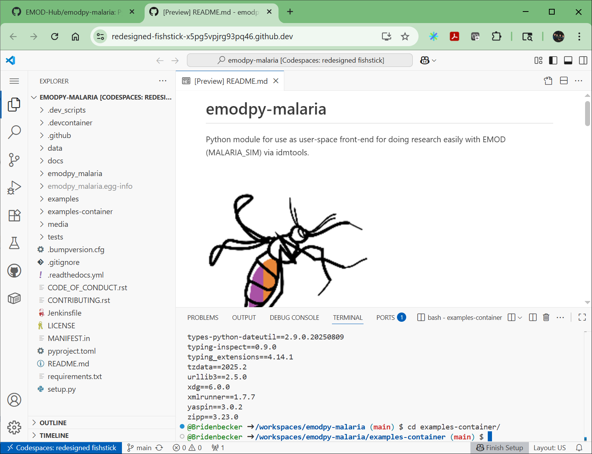
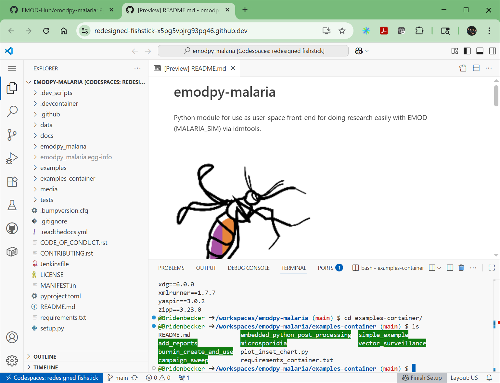
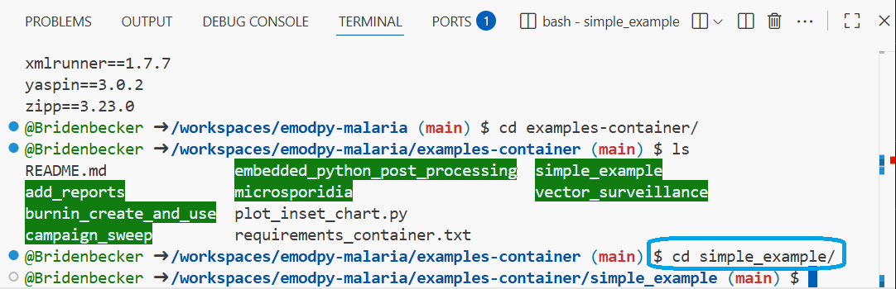
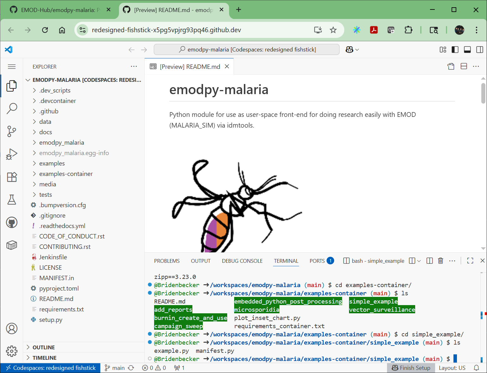
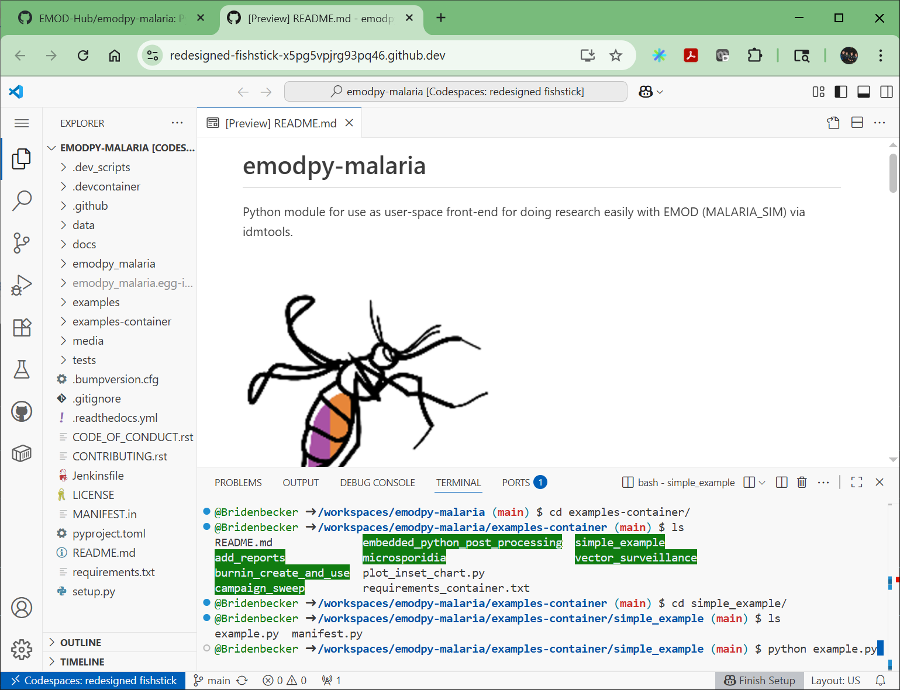
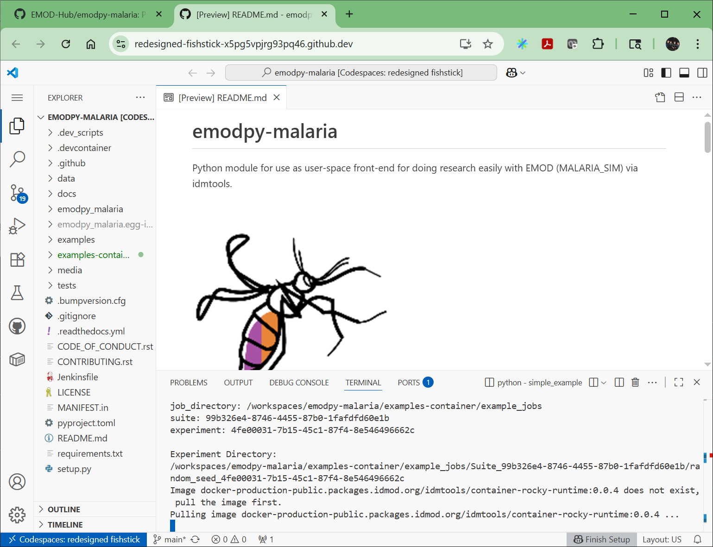
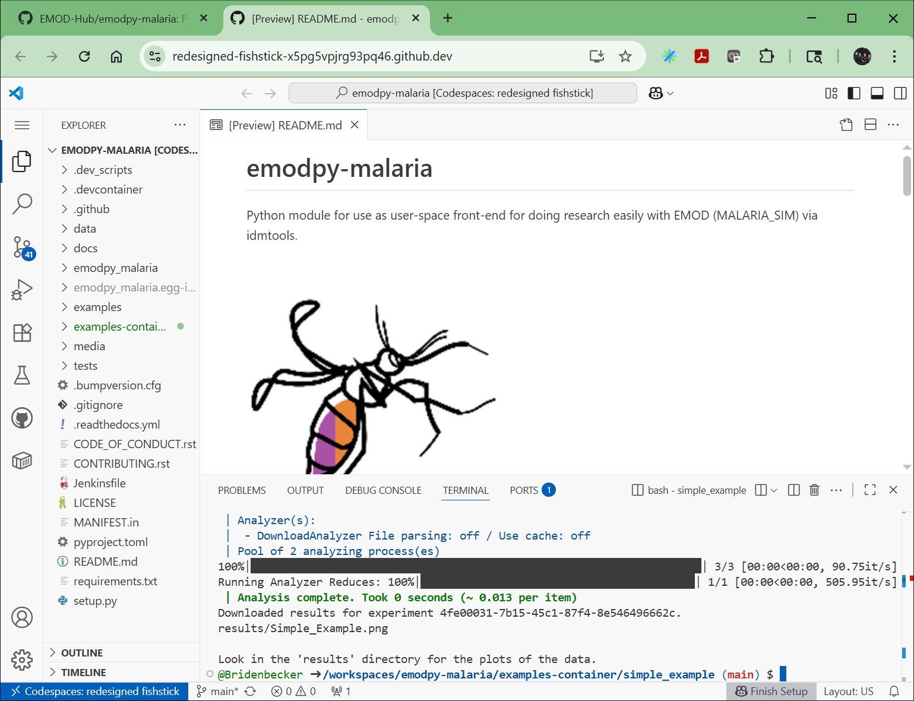
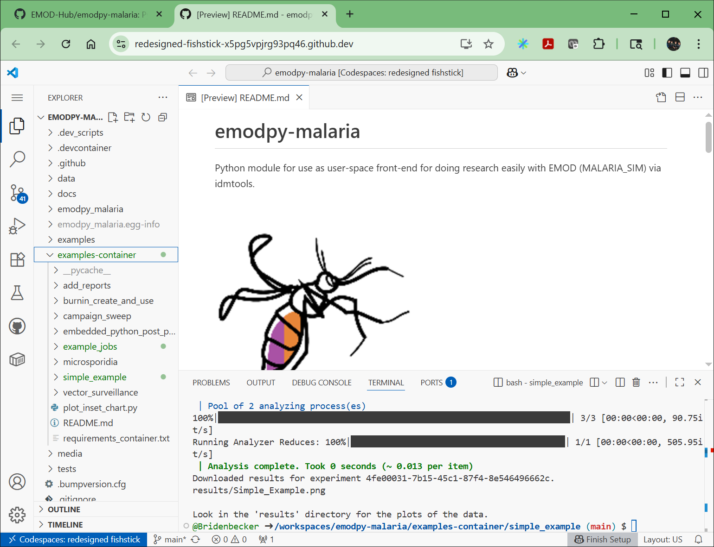
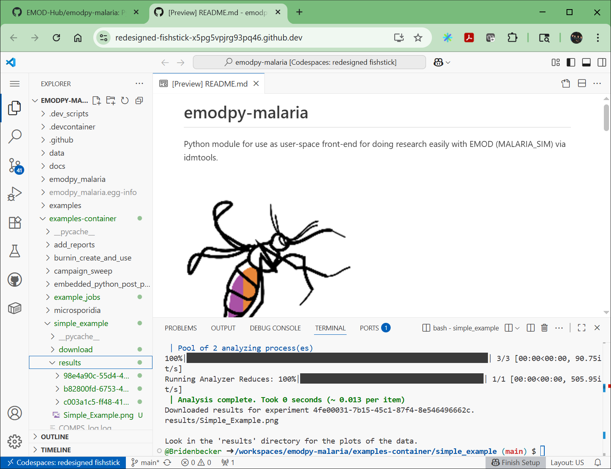
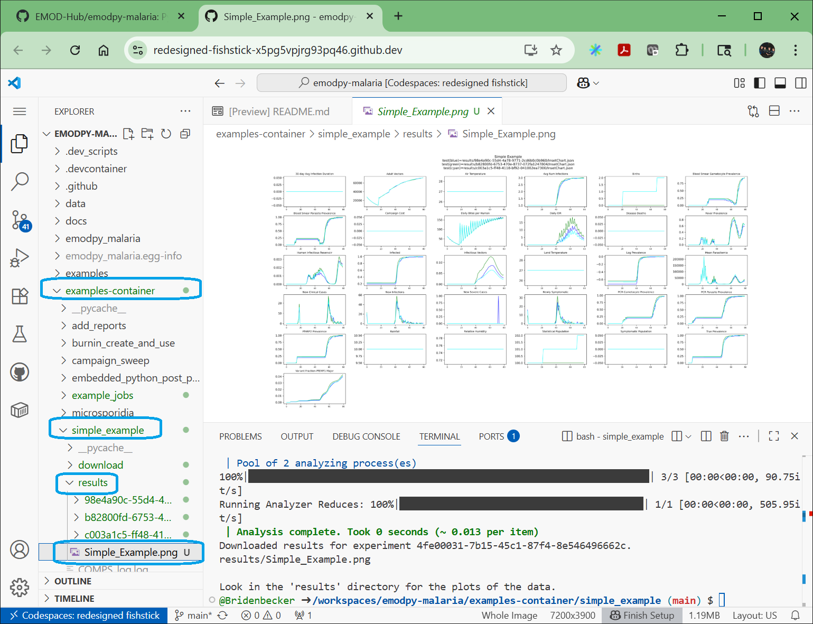

# Run the Simple Example in Codespaces

This tutorial will guide you through the steps to run a simple example of
EMOD-Malaria within GitHub Codespaces.  Everything will be on the web so
you don't need to install anything at this time.

## Prerequisites

The followign instructions assume you have Codespaces started on the
emopdy-malaria repository.  To learn how to do this, please the
[Starting Codespaces Tutorial](tutorial_starting_codespaces.md)

## Run an EMOD

1. Execute the following command in the “terminal” window

    ```
    cd examples-container
    ```

    

2. See what examples there are by executing the following command:
    ```
    ls
    ```

    

3. Enter the “simple_example” directory by executing the following command:

    ```
    cd simple_example
    ```

    

4. See what files are in this directory by executing the following command:

    ```
    ls
    ```

    

5. Run the example with the following command:

    ```
    python example.py
    ```

    

    This step “Pulling image docker-production-public…”  may take a few minutes.

    

    When the simulation is done, you should see the following:

    

## View the results

Now that we have run EMOD, lets look at some data to see what happend in the simulations.

1. In the file browser on the left, click on the ">" next to the _examples-container_ folder.

    

2. Next, click on the ">" next to the _simple_example_ folder.

    

3. Next, click on the ">" next to the _results_ folder.

    

4. Select the file names **Simple_Example.png".

    

