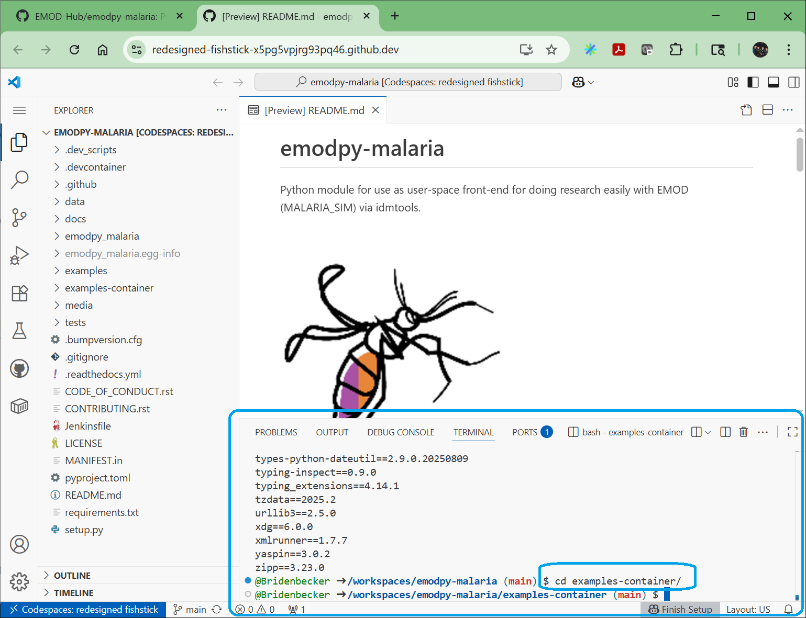
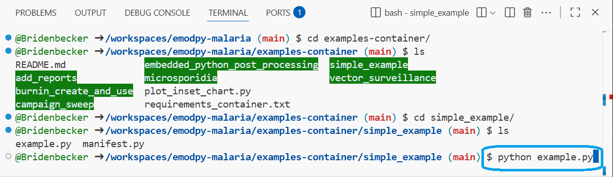
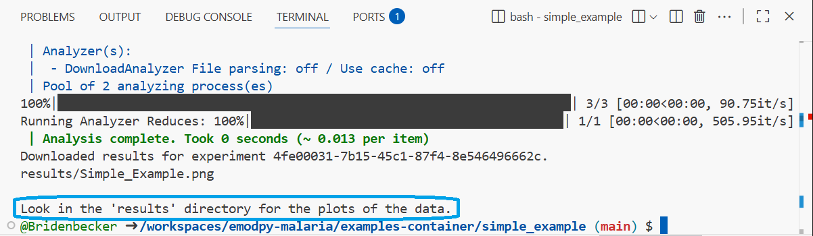

# Run the Simple Example in Codespaces

This tutorial will guide you through the steps to run a simple example of
EMOD-Malaria within GitHub Codespaces.  Everything will be on the web so
you don't need to install anything at this time.

## Prerequisites

The followign instructions assume you have Codespaces started on the
emopdy-malaria repository.  To learn how to do this, please the
[Starting Codespaces Tutorial](tutorial_starting_codespaces.md)

## Run EMOD example

1. Execute the following command in the “terminal” window

    ```
    cd examples-container
    ```

    "cd" stands for _change directory_

    

    Notice that the line after executing the command says what folder you are in.
    In our case, the folder you are in should be:

    ```
    /workspaces/emodpy-malaria/examples-container
    ```
    
    Most of the following instructions are going to take place in this terminal window.

2. See what examples there are by executing the following command:
    ```
    ls
    ```

    "ls" stands for _list files/directories_

    

3. Enter the “simple_example” directory by executing the following command:

    ```
    cd simple_example
    ```

    

4. See what files are in this directory by executing the following command:

    ```
    ls
    ```

    

5. Run the example with the following command:

    ```
    python example.py
    ```

    

    This step “Pulling image docker-production-public…”  may take a few minutes,
    but will only happen once per codespace image.

    

    When the simulation is done, you should see the following:

    

## View the results

Now that we have run EMOD, lets look at some data to see what happend in the simulations.

1. In the file browser on the left, click on the ">" next to the _examples-container_ folder
and continue navigating to the folder:

    ```
    examples-container > simple_example > results
    ```

2. Select the file name **Simple_Example.png".

    

## Understand the results

The [next "tutorial"](tutorial_interpret_results.md) explains what you are seeing in this image.

