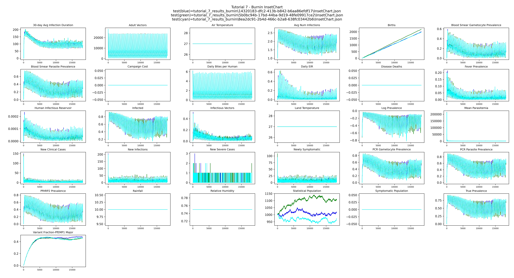
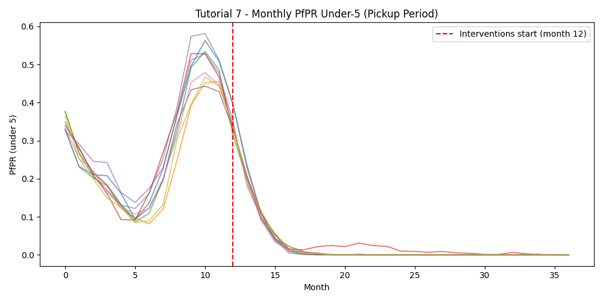

# Tutorial 7: Serialization

The main reason to run a burnin is to develop a realistic immunity profile in the population.
EMOD tracks antibodies and immunity at the individual level — each person's immune state
reflects their lifetime history of infections. To get that right, you need to simulate many
years of transmission so people of every age have had the infections they would have
experienced in real life. Starting an intervention scenario from year zero means the population
has no immunity at all, which produces unrealistic results.

A burnin also establishes realistic age structure, infection history, and vector dynamics. All
of this takes 50 or more simulated years to develop before interventions can be meaningfully
evaluated.

The solution is to run one set of long simulations, save (serialize) the full population state
to disk, and then start every subsequent intervention scenario from that saved state rather
than from scratch.

!!! note "Modeling a real site"
    For a study at a real location you would include that site's historical interventions in
    the burnin so the population's immunity reflects what people there have actually
    experienced. Interventions affect natural immunity — for example, a population with highly
    effective bed nets over many years will have less naturally acquired immunity than one
    without nets, because they have had fewer infections. The burnin in this tutorial uses no
    interventions to keep things simple.

Tutorial 7 is split into two scripts:

| Script | Purpose |
|--------|---------|
| `tutorial_7_burnin.py` | Simulate 50 years with no interventions and serialize the population — requires `CALIBRATED_LOG10_X_LARVAL_HABITAT` from Tutorial 6 |
| `tutorial_7_pickup.py` | Load the serialized states and run intervention scenarios from them |

## Part 1: Burnin

**File:** `tutorials/tutorial_7_burnin.py`

### Serialization parameters

Four parameters in `set_param_fn()` tell EMOD to write a population snapshot at the end of
the simulation:

```python
config.parameters.Serialized_Population_Writing_Type = "TIMESTEP"
config.parameters.Serialization_Time_Steps           = [serialize_years * 365]
config.parameters.Serialization_Mask_Node_Write      = 0
config.parameters.Serialization_Precision            = "REDUCED"
```

`Serialization_Time_Steps` is a list of days at which to write snapshots — here, the last
day of the 50-year run. EMOD writes the population to a `.dtk` file named `state-NNNNN.dtk`
where `NNNNN` is the timestep zero-padded to five digits (e.g. `state-18250.dtk` for day
18250).

`Serialization_Precision` controls how much detail is saved. `REDUCED` gives smaller files
but with some loss of numerical precision. Full precision allows byte-wise exact
reproducibility: a simulation run continuously from day 0 to 1000 will produce output
identical to one that runs to day 500, serializes, then picks up and runs to day 1000 —
aside from very small floating-point rounding differences. `REDUCED` still gives very similar
results but will not reproduce the continuous run exactly. For most intervention studies this
is acceptable; choose full precision if exact reproducibility matters for your analysis.

### Stochastic replicates

The burnin runs `N_BURNIN_RUNS` simulations with different random seeds, producing
independent population states that each have a different immune history:

```python
builder.add_sweep_definition(sweep_run_number, range(N_BURNIN_RUNS))
```

### Getting the experiment ID

When the burnin finishes, the experiment ID is printed:

```
Copy this experiment ID into tutorial_7_pickup.py:

    BURNIN_EXP_ID = "xxxxxxxx-xxxx-xxxx-xxxx-xxxxxxxxxxxx"
```

Paste this value into `BURNIN_EXP_ID` at the top of `tutorial_7_pickup.py` before running
Part 2.

## Part 2: Pickup

**File:** `tutorials/tutorial_7_pickup.py`

### The sweep: immune history × stochastic variation

The pickup runs a cross-product of two sweep dimensions:

```python
builder.add_sweep_definition(
    partial(update_serialize_parameters, df=burnin_df),
    range(n_burnin)
)
builder.add_sweep_definition(sweep_run_number, range(N_SIMS_PER_PICKUP))
```

The first dimension links each pickup simulation to a burnin replicate, capturing variation
in immune history. The second adds independent stochastic variation on top of each starting
state. With `N_BURNIN_RUNS=3` and `N_SIMS_PER_PICKUP=3` this produces 9 pickup simulations.

To also sweep an intervention parameter such as treatment-seeking coverage, add a third sweep
definition following the same pattern as Tutorial 5.

### Locating the burnin output

`get_burnin_df()` loads the burnin experiment by ID, retrieves each simulation's output
directory, and returns a DataFrame sorted by `Run_Number` — one row per burnin simulation.
Path resolution differs by platform:

```python
if platform_type == "COMPS":
    path = sim.get_platform_object().hpc_jobs[0].working_directory
    path = path.replace("\\", "/").replace("internal.idm.ctr", "mnt").replace("IDM2", "idm2")
    outpath = path + "/output"
elif hasattr(platform, 'data_mount'):
    # Container: EMOD runs inside Docker, convert host path to container path
    from idmtools_platform_container.utils.general import map_container_path
    host_path = str(sim.get_directory())
    container_path = map_container_path(platform.job_directory, platform.data_mount, host_path)
    outpath = container_path + "/output"
else:
    outpath = os.path.join(str(sim.get_directory()), "output")
```

On the Container platform, `sim.get_directory()` returns the host filesystem path, but EMOD
runs inside Docker where `job_directory` is mounted at `data_mount`. `map_container_path()`
converts the host path to the path as seen from inside the container.

### Linking each pickup to a burnin replicate

`update_serialize_parameters()` sets `Serialized_Population_Path` and
`Serialized_Population_Filenames` for each pickup simulation based on its row index into
`burnin_df`:

```python
def update_serialize_parameters(simulation, x, df):
    sim_path = df["outpath"][x]
    filename = f"state-{serialize_years * 365:05d}.dtk"
    simulation.task.config.parameters.Serialized_Population_Path      = sim_path
    simulation.task.config.parameters.Serialized_Population_Filenames = [filename]
    return {
        "Run_Number":                 int(df["run_number"][x]),
        "Serialized_Population_Path": sim_path,
    }
```

### Interventions

`build_camp()` adds treatment-seeking care and ITNs starting on day 365 of the pickup run —
the same interventions from Tutorial 3, giving the population one year to settle before
interventions begin. The pickup runs for `sim_years = 3` years.

### Output

Results are saved to `tutorial_7_results_burnin/` and `tutorial_7_results_pickup/`. The
pickup plot includes an InsetChart overlay of all replicates and a monthly PfPR figure with
a vertical line marking when interventions start (month 12).

## Example output

**Burnin InsetChart** — overlay of all burnin replicates shows stochastic spread across
independent population states:



**Pickup monthly PfPR** — under-5 PfPR across the pickup period; the red dashed line marks
when interventions begin:


